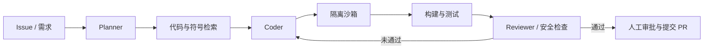

# AI 应用 / AI 全栈 / Java 电商后端场景设计题集合（2026 秋招版）

> 更新时间：2026-08-17（香港时间）
> 适用岗位：AI 应用开发、Agent、大模型应用、AI 后端/平台、AI 全栈、Java/传统后端、交易与电商后端
> 数据口径：原频率基于 2025-09 至 2026-06 的 196 份 AI 核心高置信面经；2026-07/08 后端、全栈和 AI 新帖作为独立增量，不能与旧分母混算。

本文件合并了原 26 场景版本和 2026-08-14 的 12 道“真实场景速练”版本：重叠题只保留一份完整答案，原速练版独有题移到第 6 节；8 月 15–16 日的新场景继续按 `H1` 标注，不把最近单篇包装成高频。

## 1. 频率总览

严格样本中，53/196 份出现明确场景题或系统设计信号，样本文档命中率为 **27.0%**。项目追问本身也经常在第二、三层转化为场景题，因此实际需要系统化设计能力的面试会更多。

| 层级 | 场景族 | 严格样本关键词命中 | 典型考察 |
|---|---|---:|---|
| P0 | 通用 Agent / 工作流系统设计 | 25 | 边界、编排、状态、工具、记忆、终止条件 |
| P0 | 上下文过长与记忆治理 | 17 | 分层、压缩、选择性保留、冲突与过期 |
| P0 | Agent 可靠性与异常恢复 | 15 | 超时、重试、幂等、熔断、checkpoint、人工审批 |
| P0 | 突发流量、秒杀和高并发 | 13 | 限流、削峰、背压、容量与一致性 |
| P0 | 多 Agent / Coding Agent 协作 | 12 | 任务分解、通信、共享状态、沙箱、验收 |
| P1 | Agent/RAG 评测与 badcase 闭环 | 9 | 数据集、分层指标、线上回流、版本对比 |
| P1 | 智能客服/多轮对话 | 8 | 路由、知识、流程、转人工、安全 |
| P1 | 工具过多、工具冲突与动态选择 | 4 | 工具检索、命名空间、schema、权限 |
| P1 | RAG、模型网关、NL2SQL、多模态 | 每类约 1–2 次显式“设计”命中 | 绝对次数低，但大量项目深挖会问到同类取舍 |
| 后端底座 | 缓存一致性/热点、消息积压 | 缓存 18、消息积压 1 | AI 应用仍是线上服务，不能只会模型调用 |
| 后端扩展 | 订单/库存/支付一致性、MQ 补偿 | 新增后端面经与官方电商 JD 定性补充 | 状态机、幂等、事务事件、对账、失败恢复 |
| 全栈扩展 | 从需求到上线的完整 AI 产品 | 新增全栈面经与官方 JD 定性补充 | 前后端、鉴权、流式交互、部署、产品指标 |

说明：这里只统计明确的场景表达，RAG、评测、缓存等知识在项目题中出现得远多于“设计一个……”这一狭义命中数。

本轮新增的后端/全栈题只做“真实出现或 JD 明确要求”的排序，不给虚假的命中次数。原 196 样本的 P0/P1 仍有效；目标为 Java/电商后端时，应额外把第 4 节的交易一致性题提到 P0。

### 1.1 两个旧题集的去重映射

| 2026-08-14 速练题 | 合并后位置 |
|---|---|
| 秒杀/抢票不超卖 | 4.4；订单、库存、支付一致性同时看 4.3 |
| 模型网关十倍流量 | 4.1–4.2 |
| Agent 工具失败/循环 | 3.3 |
| MQ 积压与下游变慢 | 4.7 |
| 三天 AI 搭电商商城 | 4.10 |
| Agent 自主广告投放 | 5.4 |
| 支付回调/订单幂等 | 4.3 与 4.7 |
| 接口变慢、慢 SQL Agent、10 TB 日志、单体拆分、百万 QPS 视频问答 | 本文 6.1–6.5 |

## 2. 通用答题框架

不要一上来画十几个组件。先把约束问清楚，再给最小可用架构，最后补可靠性、安全和演进。

### 八步法

1. **澄清需求**：用户是谁、任务是否高风险、是否需要实时、数据规模、QPS、峰值、准确率、延迟和成本上限。
2. **确定边界**：哪些必须确定性执行，哪些可以交给模型；Workflow、Agent 或普通服务分别负责什么。
3. **定义指标**：可用性、P95/P99、任务成功率、正确率/忠实度、单任务 token/成本、转人工率、恢复时间。
4. **最小架构**：入口、鉴权、编排、模型、检索、工具、状态存储、结果流式返回。
5. **状态与一致性**：会话、任务、工具调用、版本、幂等键和 checkpoint 存在哪里。
6. **失败路径**：超时、重试、限流、熔断、降级、补偿、人工审批、断点续跑。
7. **安全与观测**：最小权限、沙箱、提示注入防护、审计日志、trace、成本和质量看板。
8. **演进方案**：先做单 Agent/固定流程，再在真实 badcase 证明必要时引入多 Agent、动态规划或更昂贵模型。

面试中的高质量开场可以是：

> 我先确认任务风险、时延、并发、数据新鲜度和成本约束，再决定固定工作流还是 Agent。先给一个能上线的最小链路，然后分别补状态持久化、失败恢复、权限安全、评测和 10 倍流量下的演进。

## 3. P0：AI 系统场景题

### 3.1 从零设计一个 Agent / 类 GPT Web 应用

**真实问法**：从头设计 Agent 框架要分哪几层；设计单 Agent 类 GPT Web 应用；Agent 应包含哪些模块。

**答题骨架**：

- 入口层：鉴权、会话、配额、请求校验、SSE/WebSocket 流式返回。
- 编排层：固定 Workflow 或状态图；Agent 只处理需要动态决策的部分；显式终止条件和最大步数。
- 能力层：模型适配、Prompt/版本、工具注册、RAG、短期状态和长期记忆。
- 执行层：工具超时、幂等、异步任务、checkpoint、重放和人工审批。
- 数据层：会话、任务、消息、工具调用、引用、成本与 trace；敏感数据按租户隔离。
- 评测层：任务成功率、工具成功率、引用正确率、延迟、token、成本和人工接管率。

**关键取舍**：任务步骤已知且高风险时优先 Workflow；步骤无法预先穷举、需要动态观察和规划时再使用 Agent。

来源：[B站 AI 应用研发二面](https://www.nowcoder.com/feed/main/detail/a88fde0d7efc4779aa67d9841871aa90)、[广州某 Agent 后端一面](https://www.nowcoder.com/feed/main/detail/a23d2e7a98ac433a82a41c8108646780)、[字节 AI 应用开发 2026-07-21](https://www.nowcoder.com/feed/main/detail/3e22dc2df03d4227ab70ea9c2d896086)

### 3.2 上下文超长、压缩后遗忘或重复调用工具

**真实问法**：工具输出太长怎么办；对话持续数月如何管理；压缩丢失工具历史导致重复调用怎么办；用户前后给出冲突信息怎么办。

**答题骨架**：

1. 将上下文分为稳定指令、当前任务状态、近期对话、工具结果、长期记忆和外部知识，分别治理。
2. 保留不可丢的结构化状态：当前目标、计划、已完成步骤、工具调用 ID/结果摘要、约束、待确认事项。
3. 对长工具输出做解析、去重、结构化摘要和外部对象存储；上下文只放摘要、引用和按需取回句柄。
4. 近期轮次保留原文，较早轮次分段摘要；长期信息按时间、新鲜度、重要性和相关性检索。
5. 工具调用使用幂等键和调用账本，即使语言摘要丢失也不会重复执行副作用操作。
6. 冲突记忆保留来源、时间、置信度和有效期，不直接覆盖；必要时向用户确认。
7. 用“摘要前后任务成功率、事实保留率、重复工具率、token 节省、额外延迟”评测压缩，而不是只看摘要文本是否流畅。

来源：[美团智能客服二面](https://www.nowcoder.com/feed/main/detail/c2cfacf65fdb4986adc418d18bd4f8da)、[京东 AI 全栈 Agent 一面](https://www.nowcoder.com/feed/main/detail/e80b257b1c064970a72c9679c2177585)、[阿里淘天 Agent 二面](https://www.nowcoder.com/feed/main/detail/634e8a4cd4654496aa36a9eb1873ee4e)、[字节 Agent 2026-07-24](https://www.nowcoder.com/feed/main/detail/eccea78e38b447c9a3ae73570c5d00b6)

### 3.3 工具调用超时、失败、重复或死循环

**真实问法**：API 超时和报错怎么办；工具一直失败是否无限重试；如何防止 Agent 死循环；高风险资金工具如何保证安全。

**答题骨架**：

- 为模型调用和每个工具设置独立 deadline、最大步骤、最大 token 和最大成本预算。
- 只对明确的瞬时错误做有限次数、指数退避加抖动的重试；参数错误、权限错误不要重试。
- 副作用工具必须有幂等键、状态查询接口和调用账本；重试前先查上一次执行状态。
- 连续失败触发熔断；降级到规则、只读结果、较小模型或人工处理。
- 长任务用持久化状态机和 checkpoint；节点完成后落盘，恢复时从最后成功节点继续。
- 转账、删除、发信、提交代码等高风险动作必须最小权限、参数校验、预览和人工确认。
- trace 中记录模型版本、Prompt 版本、工具参数摘要、状态转换、错误类型和恢复动作。

来源：[快手 AI 应用二面](https://www.nowcoder.com/feed/main/detail/bd674fbe339d412096dd2a6c1b147b3e)、[腾讯 AI 应用后端](https://www.nowcoder.com/feed/main/detail/144c6ae334b24c0aa643ed43ccfebaac)、[字节 AI 应用开发 2026-07-21](https://www.nowcoder.com/feed/main/detail/3e22dc2df03d4227ab70ea9c2d896086)、[阿里 Agent 2026-08-05](https://www.nowcoder.com/feed/main/detail/3181217280144ee0ab47fe979dc28ff1)、[字节 AI 应用一面 2026-08-10](https://www.nowcoder.com/feed/main/detail/15af3788a038477bba99f2f9d94b2cef)

### 3.4 工具数量过多、描述冲突或 token 占用过大

**答题骨架**：

- 建立工具注册中心：名称、用途、输入/输出 schema、权限、租户、风险级别、版本和健康状态。
- 先用规则/轻量分类器做领域路由，再按任务语义检索少量候选工具；只把候选工具的必要 schema 交给模型。
- 通过命名空间和清晰、互斥的描述减少重叠；用离线冲突集测试“相近工具是否选对”。
- 对高风险工具做服务端权限校验，不能把“模型没有选择它”当安全边界。
- 监控工具选择准确率、无效调用率、冲突率、候选集大小、额外 token 和延迟。

注意：不同 Agent 宿主对工具 schema 的加载策略不同，不能笼统声称“所有工具描述一定永久驻留上下文”。

来源：[京东科技 AI 全栈 Agent](https://www.nowcoder.com/feed/main/detail/e80b257b1c064970a72c9679c2177585)、[淘天 AI 应用二面](https://www.nowcoder.com/feed/main/detail/7a2bf6ebc0554139a23bf57cc846cfdf)、[华为 AI 应用开发](https://www.nowcoder.com/feed/main/detail/4298c2b6f84f4ea7ab1606ab5521e3c8)、[字节 AI 应用一面 2026-08-10](https://www.nowcoder.com/feed/main/detail/15af3788a038477bba99f2f9d94b2cef)

### 3.5 设计多 Agent 自动 PR / Coding Agent 系统

**答题骨架**：

- 输入先结构化为验收标准、禁止改动项、仓库/分支和权限范围。
- 检索组合使用文件路径、文本、符号/LSP、AST 和语义索引；不要把代码检索简化成“grep 或 RAG 二选一”。
- Planner 产生可验证的小步骤；Coder 每步只改有限文件；状态和 diff 持久化。
- 在无生产凭证、网络受限、CPU/内存/时间受限的沙箱中构建和测试。
- Reviewer 检查测试、静态分析、依赖、权限、敏感信息、无关改动和需求覆盖。
- 重试有上限；失败保存日志和工作区快照；最终提交必须人工审批。
- 指标包括任务成功率、测试通过率、首轮通过率、无关 diff 比例、人工修改量、成本和耗时。

来源：[B站 AI 应用研发二面](https://www.nowcoder.com/feed/main/detail/a88fde0d7efc4779aa67d9841871aa90)、[美团后端 AI 2026-04-27](https://www.nowcoder.com/feed/main/detail/4a18e41893f1491fae094650eda78d6d)、[小红书 AI 应用 2026-04-28](https://www.nowcoder.com/feed/main/detail/1f23e320007847488145e52eed931c9d)

### 3.6 设计智能客服 Agent

**答题骨架**：

- 入口先做语言、租户、用户身份、风险和意图识别。
- FAQ/商品咨询走 RAG；退款、售后等确定流程走 Workflow；模糊复杂问题才允许 Agent 动态调用工具。
- 检索必须做权限过滤、来源引用、新鲜度和无答案判断。
- 订单查询、退款等工具做参数校验、幂等和人工确认；投诉、敏感或低置信问题转人工。
- 记忆区分当前会话状态与经用户同意保存的长期偏好，设置过期和更正机制。
- 离线评测按商品咨询、售后、投诉等切片；线上看一次解决率、转人工率、平均处理时长、满意度、错误动作率和成本。

来源：[阿里 AI 研发二面](https://www.nowcoder.com/feed/main/detail/01aa00724af84961929500de235bbf82)、[美团 Keeta 一面](https://www.nowcoder.com/feed/main/detail/abef26e941054c9db854cba7c81049cd)、[淘天评测场景](https://www.nowcoder.com/feed/main/detail/14987a3289584fdc839c890dda51913a)

### 3.7 从零设计企业 RAG / 知识库，并支持热更新

**答题骨架**：

1. 采集与解析：文档格式、OCR/表格、权限元数据、版本和质量校验。
2. 切分：按标题、段落、表格和语义边界；父子块保存上下文；参数由评测决定，不背固定 chunk 大小。
3. 索引：稀疏 BM25 + 稠密向量；元数据过滤；必要时 rerank。
4. 查询：改写/分解、混合召回、融合、重排、去重、上下文预算和引用。
5. 热更新：`doc_id/version/chunk_id` 可追踪；增量构建新版本，校验后切别名；删除用 tombstone，缓存随版本失效。
6. 评测：检索看 Recall@K、MRR/nDCG；生成看忠实度、答案相关性和引用正确率；端到端看任务成功率。
7. 运维：解析失败队列、索引延迟、空召回率、权限泄漏检查、回滚和成本。

来源：[和顺慧康 AI 应用开发](https://www.nowcoder.com/feed/main/detail/a1fe3eef3aad4891a3b8f03fa390ec15)、[小红书 Product Engineer](https://www.nowcoder.com/feed/main/detail/cefae139405543469602840106412c39)、[快手 Agent 2026-07-20](https://www.nowcoder.com/feed/main/detail/8ef62dcdde1340f987507d2d1e1433a8)、[字节 AI 应用一面 2026-08-10](https://www.nowcoder.com/feed/main/detail/15af3788a038477bba99f2f9d94b2cef)

### 3.8 设计 Agent/RAG 评测与 badcase 闭环

**答题骨架**：

- 先按真实业务任务切片，不用一个总分掩盖少数高风险场景。
- 数据集包含正常、边界、拒答、权限、长上下文、工具失败、提示注入和历史 badcase；训练集与评测集隔离。
- RAG 分开评检索与生成；Agent 再加规划正确率、工具选择/参数正确率、步骤数、恢复率和最终任务成功率。
- 规则指标、人工标注和 LLM-as-a-Judge 组合使用；Judge 要做一致性校准和抽样人工复核。
- 每次模型、Prompt、索引、工具 schema 变化都跑回归；线上小流量灰度，保留版本和一键回滚。
- badcase 按数据、检索、Prompt/上下文、模型、工具、编排、系统错误归因，再进入修复与回归集。

来源：[淘天 AI 应用二面](https://www.nowcoder.com/feed/main/detail/7a2bf6ebc0554139a23bf57cc846cfdf)、[京东科技 Agent](https://www.nowcoder.com/feed/main/detail/e80b257b1c064970a72c9679c2177585)、[字节 Agent 2026-08-05](https://www.nowcoder.com/feed/main/detail/617d30ab75dc40db81b291b8b98dfb13)

### 3.9 设计 NL2SQL / 问数智能体

**答题骨架**：

- 做租户、用户和数据权限校验；只向模型暴露当前用户可见的 schema、指标定义和示例。
- 链路为意图识别 → schema/指标检索 → 查询计划 → SQL 生成 → AST/规则校验 → `EXPLAIN` → 只读执行 → 结果校验与解释。
- 禁止 DDL/DML 和多语句；设置超时、扫描行数、返回行数、成本上限；高风险查询进入沙箱或人工确认。
- 对歧义指标、时间范围、单位主动追问，不让模型猜。
- 评测拆成 schema linking、SQL 执行正确率、结果正确率、拒答/澄清率、P95 和成本。

来源：[深信服 AI 开发 2026-07-30](https://www.nowcoder.com/feed/main/detail/bd008aac77a64e7cbc5d9cc164b73316)、[小红书 AI 全栈 2026-04-08](https://www.nowcoder.com/feed/main/detail/4dbb7539b78a4d1ca3d48a837b4a83d8)、[淘天 2026-04-16](https://www.nowcoder.com/feed/main/detail/80058a5c487347b5bbf7c8e5d694377d)

### 3.10 设计多模态商品图文分类系统

**答题骨架**：

- 先定义分类体系：单标签/多标签、层级标签、未知类、人工复核和更新频率。
- 文本做清洗、实体/属性抽取；图片做质量检测、OCR 和视觉编码；保留原始证据。
- 简单基线可分别编码后拼接/加权；复杂场景再使用跨模态模型或多模态大模型。
- 先召回候选类目，再精分类；低置信、图文冲突、敏感类目转人工。
- 数据按时间和商家隔离切分，避免同商品泄漏；监控类目漂移、长尾召回、延迟和人工复核率。

来源：[淘天 AI 应用二面](https://www.nowcoder.com/feed/main/detail/7a2bf6ebc0554139a23bf57cc846cfdf)

## 4. P1：平台与后端场景题

### 4.1 大模型网关：限流、路由、降级与成本

- 请求前：鉴权、租户配额、并发数、RPM/TPM、预估 token、模型白名单和风险校验。
- 路由：按任务难度、质量要求、上下文长度、时延和预算选择模型；保留固定兜底模型。
- 请求中：超时、流式取消、并发舱壁、熔断和背压。
- 请求后：按实际 token/费用记账，记录版本、延迟、错误和质量反馈。
- 降级顺序要业务化：减少候选/上下文 → 关闭非关键步骤 → 小模型 → 缓存/模板 → 排队或人工，而非简单“一律换小模型”。

来源：[深信服 AI 开发 2026-07-30](https://www.nowcoder.com/feed/main/detail/bd008aac77a64e7cbc5d9cc164b73316)、[淘天 AI 应用二面](https://www.nowcoder.com/feed/main/detail/7a2bf6ebc0554139a23bf57cc846cfdf)、[腾讯 AI 应用开发 2026-07-25](https://www.nowcoder.com/feed/main/detail/a02baa2ac6634904992561494a1746a4)

### 4.2 突发流量或大促下的 Agent 服务

- 先确认峰值 QPS、突发持续时间、模型并发上限和允许排队时间。
- 网关按用户/租户/模型分层限流；入口快速拒绝或排队，防止请求无限堆积。
- 缓存确定性结果；异步化非实时任务；合并相同请求；控制每个任务的最大工具/模型并发。
- 模型和工具使用舱壁隔离，避免一个慢供应商拖垮全部服务。
- 自动扩容只能解决计算资源，不一定能突破外部模型配额；必须有降级和容量预案。
- 观测排队时长、拒绝率、模型限流、超时率、token、成本和任务成功率。

来源：[京东科技 Agent](https://www.nowcoder.com/feed/main/detail/e80b257b1c064970a72c9679c2177585)、[阿里 AI 研发二面](https://www.nowcoder.com/feed/main/detail/01aa00724af84961929500de235bbf82)、[小红书 AI 全栈 2026-06-25](https://www.nowcoder.com/feed/main/detail/45d2815e4dc54a2fa9161273f6046c97)

### 4.3 订单、库存、支付如何保证一致性

**真实问法**：手写乐观锁库存扣减后继续追问高 CAS 失败；缓存与数据库如何一致；消息丢失、重复、积压怎么办；高并发资金/交易系统如何设计。[百度后端 2026-08-03](https://www.nowcoder.com/discuss/915256674963709952)、[百度后端 2026-08-05](https://www.nowcoder.com/feed/main/detail/1c4cf754692542868d0cd7b61a9b39a7)、[TikTok Shop 资金后端官方 JD](https://jobs.bytedance.com/campus/position/7667054527414634757/detail)

**答题骨架**：

1. 先画状态机：待支付、已支付、履约中、完成、关闭/退款；定义谁能触发转换、是否可逆、超时规则和最终事实源。
2. 创建订单使用业务幂等键；库存用数据库条件更新/乐观锁，或热点场景原子预扣 + 异步落库；任何方案都要防重复扣减和超卖。
3. 本地事务只覆盖本库。跨服务用 Outbox/事务消息记录“状态变化 + 待发送事件”，消费者幂等；不要用无界重试假装分布式事务。
4. 支付回调验签、幂等并校验订单金额/状态；乱序回调通过状态机条件更新阻断非法回退。
5. 失败时按业务定义补偿：未支付超时释放库存，已支付但下单异常进入人工/自动修复；资金类不轻率自动反向操作。
6. 定期对账订单、库存、支付和消息状态；差异进入修复队列并保留审计。
7. 指标至少含库存差异、重复消费、状态停留时长、补偿成功率、支付回调延迟、积压和人工处理量。

若接入 Agent：模型只负责理解意图和生成操作草案；订单查询可只读，退款/改价/取消等副作用 Tool 必须由服务端做身份、权限、状态、金额、幂等和风险校验，并在执行前向用户展示确定性参数。

### 4.4 秒杀、不超卖与 Agent 接口限流

- 静态资源和活动信息缓存；资格校验前置；令牌/库存预热。
- Redis Lua 或数据库条件更新原子扣减；用户维度幂等键防重复下单。
- 成功请求进入消息队列，消费者异步落库；数据库是最终事实源并做对账补偿。
- 队列有界并支持背压；超时订单释放库存；全链路监控库存差异和重复消费。
- 映射到 Agent：把“库存”替换为模型并发/TPM 预算，用令牌桶、队列和幂等任务 ID 控制调用。

来源：[懂车帝 Agent 一面](https://www.nowcoder.com/feed/main/detail/a0fc68531e1e4d02b36006f75de53919)、[淘天 AI 应用二面](https://www.nowcoder.com/feed/main/detail/7a2bf6ebc0554139a23bf57cc846cfdf)、[阿里云 AI 应用 2026-04-27](https://www.nowcoder.com/feed/main/detail/6393c4eb0f144cfba5bf355934d3b236)

### 4.5 10 万 QPS，统计最近一小时访问最多的 10 个 IP

- 入口日志进入 Kafka/Pulsar；按 IP 哈希分区。
- 精确方案：按分钟/秒维护滚动桶，过期桶从总计数中扣除；分片局部 Top K，再做全局合并。
- 内存受限可用 Count-Min Sketch 估频，再用候选最小堆维护 Top K；明确这是近似方案及误差边界。
- 处理乱序、重复事件、窗口边界、热点 IP 和故障恢复；流处理状态做 checkpoint。
- 先估算事件量、状态大小和可接受误差，再决定精确或近似。

来源：[字节 Agent 二面 2026-05-03](https://www.nowcoder.com/feed/main/detail/d9c10e9ec1294800990b6388a8bb9229)

### 4.6 Redis 与数据库一致性、热点和缓存故障

- 常规读多写少场景用 Cache Aside：读缓存，未命中回源；写数据库成功后删除缓存。
- 删除失败用事务消息/Outbox、重试或 CDC/binlog 消费兜底；缓存值带版本，旧版本不能覆盖新版本。
- 热点 key 做本地缓存、请求合并、分片或只读副本；击穿用互斥/单飞；穿透用参数校验、空值或布隆过滤器；雪崩用过期抖动和限流。
- 强一致资金/库存判断不要依赖普通缓存作为事实源。

来源：[深信服二面 2026-06-23](https://www.nowcoder.com/feed/main/detail/7fd4389e0a0844faa4dce49ba5e5c3f1)、[阿里后端 AI 2026-05-08](https://www.nowcoder.com/feed/main/detail/8e21c32559334f2e9be2aba5e5b33fb0)、[快手 Agent 2026-06-25](https://www.nowcoder.com/feed/main/detail/c48aa5448c284cf3870235bd874d67e8)

### 4.7 MQ 丢失、重复、积压与补偿

- 先判断生产突增、下游变慢、消费者故障、分区不足、rebalance 还是单条毒消息。
- 降低上游速率或开启背压；扩消费者前先确认分区数；慢操作批量化/异步化。
- 生产侧用确认、重试和 Outbox/事务消息避免“业务提交但消息没发”；消费侧必须幂等，提交 offset 的时机与业务事务相匹配。
- 毒消息进入隔离/死信队列；保留 offset、事件 ID、处理状态和受控重放能力；重放前评估副作用。
- 若修改分区，说明有序性、键路由和存量数据不会自动重新均匀分布等影响。
- 对订单/库存等关键链路做状态对账和补偿；“至少一次 + 业务幂等”通常比笼统承诺端到端 exactly-once 更可辩护。
- 监控 lag、消费速率、处理时长、失败重试、最老消息年龄、重复率、死信量和对账差异。

来源：[京东科技 AI 全栈 Agent](https://www.nowcoder.com/feed/main/detail/e80b257b1c064970a72c9679c2177585)、[深信服 AI 开发二面](https://www.nowcoder.com/feed/main/detail/bd008aac77a64e7cbc5d9cc164b73316)、[百度后端一面 2026-08-05](https://www.nowcoder.com/feed/main/detail/1c4cf754692542868d0cd7b61a9b39a7)

### 4.8 长耗时任务 A 完成后自动执行 B，并通知用户

- 把 A、B 表示为持久化 DAG/状态机节点，而不是让一次 ReAct 调用阻塞 5–10 分钟。
- 调度器创建 `run_id` 和节点幂等键；Worker 异步执行 A；完成事件触发 B。
- 状态转换使用条件更新或事务事件，防止重复触发；失败按错误类型有限重试。
- 用户可查询进度，完成后通过站内信/WebSocket/回调通知；断点恢复从最后成功节点继续。
- 设置取消、超时、补偿和死信处理。

来源：[广州某 Agent 后端一面](https://www.nowcoder.com/feed/main/detail/a23d2e7a98ac433a82a41c8108646780)

### 4.9 安全沙箱中的代码/命令工具

- 容器/微虚机隔离进程和文件系统；Linux 可组合 namespaces、cgroups、只读基础镜像、seccomp/AppArmor。
- 默认无生产凭证、限制网络出口和挂载；临时凭证最小权限且短时有效。
- 设置 CPU、内存、进程数、磁盘、执行时长和输出大小上限。
- 高危命令不能只靠大模型判断；使用命令/系统调用策略、目录白名单和人工审批。
- 保存审计日志、输入输出摘要、镜像版本和快照；执行结束销毁环境。

来源：[字节 Agent 2026-08-05](https://www.nowcoder.com/feed/main/detail/617d30ab75dc40db81b291b8b98dfb13)、[深信服 AI 开发 2026-07-30](https://www.nowcoder.com/feed/main/detail/bd008aac77a64e7cbc5d9cc164b73316)、[B站 AI 应用研发二面](https://www.nowcoder.com/feed/main/detail/a88fde0d7efc4779aa67d9841871aa90)

### 4.10 从零交付一个 AI 全栈产品

**真实/官方问法**：React Hooks 和设计稿还原、MySQL 与 MongoDB 如何选、鉴权怎么做；能否一个人完成需求、产品方案、前后端、上线和指标；Agent 如何扩到 5,000–6,000 用户、日请求 10 万以上。[AI 全栈实习一面 2026-08-04](https://www.nowcoder.com/feed/main/detail/ec954b741e014744b173ed73635e625a)、[小红书 Agentic 全栈 2026-08-07](https://www.nowcoder.com/feed/main/detail/e5e9311a623940eead6ec98c65e7f9e8)、[美团 AI 全栈官方 JD](https://zhaopin.meituan.com/web/position/detail?jobUnionId=3647684690&highlightType=campus)

**答题骨架**：

- 用户与验收：先定义一个核心用户任务、成功条件和第一版不做什么；页面数量不是价值指标。
- 前端：登录/权限、会话与任务列表、流式输出、取消/重试、引用/工具状态、错误与空状态；流式文本优先考虑 SSE，双向实时控制再评估 WebSocket。
- 后端：API/BFF、鉴权、会话/任务状态、Agent/Workflow 编排、模型网关、RAG/Tool、异步 Worker；副作用操作从模型执行层隔离。
- 数据：关系型数据库保存用户、任务、权限和事务状态；对象存储放大文件；向量索引服务语义检索。MongoDB 不是“AI 项目默认数据库”，按查询、一致性和 schema 演进选择。
- 发布：环境变量/密钥、容器化、数据库迁移、CI、灰度、健康检查、日志/trace、告警与回滚；前端错误和后端 trace 用 `request_id/run_id` 关联。
- 指标：激活、留存、核心任务完成率、人工接管/重试、P95、错误率、token/成本、工具成功率；区分产品指标与模型离线指标。
- 扩容：无状态 API 横向扩展；长任务异步化；模型/工具按供应商舱壁隔离；配额、排队、背压、缓存和降级；外部模型限额不能靠加机器解决。
- AI Coding：先跑基线、约束改动范围、审查 diff、补测试与安全检查；能解释所有提交代码。

### 4.11 电商搜索框 / 商品问答如何设计

**真实问法**：设计电商搜索框；如何把商品、用户与 Agent/RAG 结合。[滴滴 AI Agent 后端](https://www.nowcoder.com/feed/main/detail/17ee6ae95cc44ec19b9eefadb69da6b3)

- 搜索输入先做拼写纠错、联想、类目/品牌/属性识别和敏感词处理；查询日志需隐私治理。
- 商品召回组合倒排、类目/属性过滤、向量语义召回；排序考虑相关性、库存、新鲜度、质量和业务约束，广告/运营规则要显式而非暗藏在模型 Prompt。
- 商品问答可用 RAG 回答参数、使用说明和政策；价格、库存、配送时效通过实时 Tool/数据库查询，不能依赖生成模型记忆。
- 个性化使用经授权的用户特征；避免把敏感画像直接拼入上下文，按租户/用户做数据权限隔离。
- 评测拆成 query 理解、召回、排序、答案忠实度、实时事实正确率和业务转化；线上 A/B 关注零结果率、点击/加购、延迟和投诉。
- 高峰期对联想、热门查询和商品静态信息缓存；实时库存与价格设置短 TTL 或直查事实服务，并有降级标识。

## 5. 低频但高区分度的开放题

### 5.1 黑产交易行为相似检索

不要直接把交易字段拼成文本做普通语义向量。先定义欺诈行为表示：时间序列、金额分布、设备/账户/店铺图关系、操作节奏、地理跳变和历史标签；可用监督/度量学习得到行为向量，结合图召回、规则候选和时间衰减。再做候选排序、风险校准和人工审核，评测看高风险召回、误杀率、不同攻击模式覆盖及时间外泛化。

来源：[滴滴 Agent 二面 2026-07-29](https://www.nowcoder.com/feed/main/detail/b9a506a562c34e238782365f0f8988e9)（帖子结构较精炼，作为 B 级佐证，不作为频率统计唯一证据）

### 5.2 一千条数据求和，如何设计处理流程

先指出求和是确定性计算，不需要大模型。数据量只有一千条时单进程即可；若题目扩展到海量数据，再按分片 Map 求局部和、Reduce 汇总，处理溢出、重复、缺失、重试幂等和校验。面试官通常在看是否会识别任务性质，而不是是否能堆 AI 组件。

来源：[快手 AI Agent 2026-07-20](https://www.nowcoder.com/feed/main/detail/8ef62dcdde1340f987507d2d1e1433a8)

### 5.3 AI 行程规划并结合地图 API 做路径优化

大模型负责自然语言约束抽取和偏好交互；地点解析、距离矩阵、营业时间、交通和路径优化交给地图 API 与确定性优化器。先生成候选点，再解带时间窗的路线问题；不可达、闭店、天气变化时重规划。评测看约束满足率、路线成本、工具正确率和用户修改次数。

来源：[小红书 AI 全栈 2026-06-25](https://www.nowcoder.com/feed/main/detail/45d2815e4dc54a2fa9161273f6046c97)

### 5.4 Agent 如何让广告投放策略自我迭代并执行

**真实问法**：通过 Agent 实现广告投放的自我迭代，能判断哪种投放方式更优并执行，如何设计。[小红书 Agent 开发一面 2026-08-12](https://www.nowcoder.com/feed/main/detail/f1ed02bfdae04730837753b62e0d58b9)

这是一道单一最新 A 级来源的开放题，只证明真实问过，不能据此提升为高频。回答应把“生成策略”“因果评估”和“执行权限”分开：

1. 先定义目标和硬约束：转化/ROI、预算、品牌安全、频控、人群合规、探索上限和停止条件；不能让模型自行发明优化目标。
2. Agent 负责读取活动上下文、提出有限候选策略和解释；定向、出价、预算等参数必须通过结构化 schema 与规则校验。
3. 优劣判断依赖随机对照、A/B、multi-armed bandit 或受约束优化，使用延迟转化归因与置信区间；不能把点击上升直接当因果提升。
4. 在线执行先用影子模式/离线回放，再小流量灰度；每次改动设预算、受众、时间和变化幅度上限，高风险调整需人工批准。
5. 保存策略版本、实验分桶、特征/模型版本、工具参数和结果；用幂等键防重复投放，支持一键暂停和回滚到稳定策略。
6. 防止奖励作弊和短期指标绑架：同时监控退款、投诉、长期留存、品牌/合规风险，并保留确定性安全护栏。
7. 多 Agent 不是默认答案。第一版可用“策略生成器 + 确定性实验/执行服务”；只有真实冲突证明必要时，再拆 Planner/Critic/Executor。

## 6. 合并后新增的真实场景

本节均为可回查实问。除 6.1 的“接口排障题族”有多篇交叉外，其余按 `H1` 使用；准备价值高不等于出现频率高。

### 6.1 [H2，跨岗反复实问] 线上接口突然变慢，怎样从现象查到根因

**真实问法**：`接口响应突然变慢，从哪些维度排查？` [拼多多交易后端](https://www.nowcoder.com/feed/main/detail/5f6dc5e01e1643b2944020973ef2b2df)、[后端场景面经](https://www.nowcoder.com/feed/main/detail/0a3142d863914f689cc76fbc3bb68ba6)

1. 先定影响范围：P50/P95/P99、错误率、流量、租户/机房/版本、发布时间和依赖变更。
2. 沿 trace 拆 DNS/TCP/TLS、网关排队、线程/连接池、CPU/GC/锁、SQL、缓存、RPC/模型；和正常实例、旧版本做对照。
3. 先限流、熔断、降级或回滚止损，再保留 thread/heap dump、profile、慢日志和调用样本；只重启会丢现场。
4. 修复后用同数据与同流量回放，验证 SLO、资源曲线和错误率，并补对应告警与演练。

### 6.2 [H1，真实单篇] 让 Agent 分析一条生产慢 SQL

**真实问法**：`给 Agent 一条执行很慢的 SQL，从头到尾怎么分析和处理？` [京东科技 AI 全栈 Agent](https://www.nowcoder.com/feed/main/detail/e80b257b1c064970a72c9679c2177585)

- 只读采集脱敏 SQL/参数形态、schema、索引、统计信息、EXPLAIN/ANALYZE、锁与负载；规则和模型生成带证据的原因候选。
- 在影子库/沙箱验证索引和改写，比较扫描行、回表、锁、P95 与写放大，输出收益、风险和回滚方案。
- 默认只建议，不自动对生产做 DDL、kill 或参数修改；高风险动作审批、凭证最小权限、租户隔离、成本上限和审计。

### 6.3 [H1，真实单篇] 每天 10 TB 日志，支持 1 分钟到 1 年范围查询

**真实问法**：`是否所有数据都走 ES？如何冷热分离并提供时间范围查询 REST API？` [原帖](https://www.nowcoder.com/feed/main/detail/9bbc45a369ed4c3b9f63d7b54decc11e)

- 先问保留期、近期/历史查询占比、字段与全文比例、P95、压缩、合规删除和导出规模。
- 热数据按时间/租户进入搜索系统；温冷数据压缩成列式文件进对象存储，元数据目录负责分片定位，查询层按时间路由并限制扫描。
- 生命周期自动 rollover、降副本和归档；历史长查询异步执行。容量按日写入 × 保留期 × 索引膨胀 × 副本/压缩估算，一年数据不全放 ES。

### 6.4 [H1，真实单篇] 老单体怎样渐进拆成微服务

**真实问法**：`单体老项目怎么改造成微服务？拆太细有什么问题？` [要务科技 AI 应用开发](https://www.nowcoder.com/feed/main/detail/e07bd10a97f84ece9f2ce6298b2ca72c)

- 先按业务域、数据所有权、变更频率和团队边界在单体内模块化并建立观测基线；优先抽低耦合高收益域，用防腐层和绞杀者模式灰度迁移。
- 服务拥有自己的数据；跨服务一致性用本地事务 + outbox/可靠事件/补偿，契约版本兼容，迁移期做双读校验和回滚。
- 按 Controller 拆只会保留共享库耦合并增加网络、排障、发布和事务成本；拆分收益必须覆盖运维复杂度。

### 6.5 [H1，真实单篇] 百万 QPS 的视频问答 Agent

**真实问法**：`设计视频问答 Agent，百万 QPS 怎么处理？` [原帖](https://www.nowcoder.com/feed/main/detail/11632be0cb074747b75ac11a20c13aa0)

- 先澄清“百万”是请求、并发还是 token 流量，视频能否预处理、答案可缓存性、延迟、版权和租户配额。
- 离线做抽帧/ASR/分段/Embedding 和时间戳索引；在线鉴权限流、热点缓存、检索相关片段、大小模型路由/批处理，SSE 返回带时间引用的答案。
- 预处理与在线问答隔离，队列背压、按租户分片；过载先降级到检索片段或异步任务，并控制内容安全、隐私和单任务预算。

### 6.6 [H1，2026-08-16] 2–3 秒内聚合异构接口的大屏

**真实问法**：`多个网络/数据库接口的数据要整合给前端大屏，前端最多接受 2–3 秒，部分接口失败怎么办？` [华铁视通中级开发一面](https://www.nowcoder.com/feed/main/detail/3c5502fd7e194b54956f76b279a802ae)

- 定义每个数据块的新鲜度、deadline 和是否允许旧值；后端 BFF/聚合层统一 schema，独立调用用受控并发 fan-out，而非无限创建线程。
- 实时性低的数据预聚合到读模型/物化表或缓存；实时调用设置单依赖超时、隔离舱、熔断和全局 deadline，响应带每块的 `data/status/asOf`。
- 部分失败返回缓存旧值或明确 unavailable，不让一个非核心图表拖垮整页；后台重试、告警并记录 trace。验证整体 P95/P99、陈旧率和部分成功率。

### 6.7 [H1，2026-08-15] 报表接口 MCP 化，怎样鉴权和处理大结果

**真实问法**：`MCP 是封装工具还是 Agent？自然语言怎样变成字段/日期？分页由谁控制，报表很大怎样降级？` [快手商业化后端一面](https://www.nowcoder.com/feed/main/detail/53ccfc01dc7647819cc67c7b628edf98)

- MCP Server 暴露结构化报表工具，模型只生成 schema 内参数；服务端重新做用户/租户/字段级鉴权、日期/扫描量上限和审计，再调用原报表服务。
- 小结果返回结构化数据；大结果返回摘要、游标或异步导出任务/对象存储句柄，不把全量报表放进模型上下文。
- 全链路 deadline、取消、任务幂等、脱敏和下载链接过期；自然语言不能直接拼 SQL，也不能决定自己有无权限。

### 6.8 [H1，2026-08-15] 设计支持“窗口失败率”规则的告警平台

**真实问法**：`一分钟内失败两次怎么聚合？规则改成成功率怎么办？Redis 计数器 QPS 太高怎么优化？` [快手商业化后端一面](https://www.nowcoder.com/feed/main/detail/53ccfc01dc7647819cc67c7b628edf98)

- 事件包含租户、接口、结果、错误类、时间和幂等 id；流处理/消费者按 `(tenant, endpoint, ruleWindow)` 聚合成功数、失败数和样本错误，规则引擎计算次数、比例和持续时长。
- 去重、乱序水位、窗口关闭/迟到数据、静默期和告警恢复都要定义；告警发送经独立通道重试，避免故障风暴反压业务链路。
- 高 QPS 下先本地/流式聚合后批量写，按 key 分片并只保存必要计数；完整失败报文进日志/对象存储而非 Redis。验证检测延迟、漏报、误报和风暴抑制。

### 6.9 [H1，最新两篇] 多 Agent Code Review 的路由、冲突和降级

**真实问法**：`为什么不是一个 Agent？如何选择需要启动的专家？相似结果如何去重，一个 Agent 失败怎么办？` [钉学科技 FDE](https://www.nowcoder.com/feed/main/detail/c837307a81854e208eea037766f0bdcf)、[快手商业化后端](https://www.nowcoder.com/feed/main/detail/53ccfc01dc7647819cc67c7b628edf98)

- Router 从 PR 描述、文件类型、diff 和规则命中得到候选专家；简单改动不启动全部 Agent。各专家并行输出统一 schema、证据和严重度。
- 确定性 key 先去重，再做语义聚类；不同风险类别可并存，冲突由 Supervisor 按安全级别、证据和策略裁决并保留原始轨迹。
- 单专家失败不必让整单失败：标记覆盖缺口、有限重试/降级规则审查；高风险文件缺少关键专家时阻断。用人工金标测漏报、误报、重复率、延迟和成本。

### 6.10 [H1，2026-08-15] HITL 长时间无人处理，Checkpoint 怎样恢复

**真实问法**：`人工确认超时怎么办？MySQL/Redis 不一致怎么办？恢复时换模型怎么办？` [钉学科技 FDE](https://www.nowcoder.com/feed/main/detail/c837307a81854e208eea037766f0bdcf)

- Checkpoint 保存最小 State、当前节点、消息/工具账本、幂等键和图/模型/Prompt/工具版本；MySQL 作事实源，Redis 只做带版本的缓存/租约。
- 人工等待设置 TTL、提醒、取消/转人工和资源释放；恢复先校验版本和副作用账本，不重复执行已成功工具。
- 默认按原版本恢复；切模型创建显式分支/新 run 并重新校验状态。用故障注入验证进程崩溃、重复恢复、过期审批和版本升级。

### 6.11 [H1，2026-08-15] SaaS 多租户与漏写 tenant_id 的纵深防御

**真实问法**：`多租户怎么隔离？SQL 漏带 tenant_id 如何兜底？权限变化后缓存怎么办？` [纷享销客 Java 后端一面](https://www.nowcoder.com/feed/main/detail/e5a578710c214e94891132895f6bce7b)

- 按合规/规模选独库、独 schema 或共享表；共享表主键、唯一索引和常用索引带 tenant，认证上下文提供租户而非信任用户参数。
- MyBatis/DAO 层 AST 拦截统一注入并默认拒绝缺租户语句；后台跨租户接口单独授权，覆盖 JOIN、子查询、批量和异步任务，并做跨租户测试和审计。
- 权限变更以 DB + outbox/CDC 发失效事件，缓存 key 带权限版本、短 TTL 兜底；敏感操作强制校验最新版本。

### 6.12 [H1，2026-08-16] 点赞位图、异步计数与页面新鲜度

**真实问法**：`位图按动态还是用户建？四个人各十份文档有几个？Java 点赞同步还是异步，怎么保证不阻塞？` [中国东信日常实习一面](https://www.nowcoder.com/feed/main/detail/4f407dfeef774d8cb3b5ea58f2d0b10c)

- 先按查询模式选数据结构：常查“谁赞了内容”可一内容一逻辑 bitmap，40 份文档即 40 个；用户 ID 稀疏时比较 RoaringBitmap、Set/ZSet 或关系表。
- 主写以 `(target,user)` 唯一/原子防重，立即返回用户点赞状态；计数、通知、推荐特征可经 MQ 异步并幂等消费。线程池/队列有界，不能用异步掩盖过载。
- 计数允许短暂最终一致并携带更新时间；处理取消、内容删除、热点/大 Key、映射回收和定期对账。

## 7. 场景题常见失分点

- 没有问约束就直接堆 LangChain、向量库、Redis、Kafka 和多 Agent。
- 把 Workflow 和 Agent 混为一谈，所有步骤都交给模型自由决定。
- 只讲正常路径，不讲超时、重复、部分成功、恢复、回滚和人工确认。
- 只讲“准确率”，没有任务切片、指标定义、数据来源和基线。
- 把长期记忆与 RAG 简化成“动态数据和静态数据”的区别。二者都可能动态；核心区别是信息角色和生命周期：记忆服务于用户/任务历史，RAG 服务于外部知识检索。
- 高风险工具只用 Prompt 约束，没有服务端权限、参数校验、幂等和审计。
- 说“多 Agent 效果一定更好”，却没有计算通信成本、冲突、延迟和调试复杂度。
- 说“重试三次”但不区分错误类型，也没有幂等和退避。
- 把所有工具 schema、全部历史和所有检索块一次性塞进上下文。
- 对确定性任务也强行使用大模型，反而增加成本和不确定性。
- 让模型直接决定库存、金额、支付状态或权限，把 Prompt 当事务与授权边界。
- 订单、支付、库存只讲最终一致，却没有状态机、幂等键、事件落库、对账和人工修复路径。
- AI 全栈只画聊天页面，没有登录、任务状态、取消/重试、部署、埋点和上线后指标。

## 8. 模拟练习方式

每题限制 12 分钟：2 分钟澄清，3 分钟画最小架构，4 分钟讲数据与失败路径，2 分钟讲评测/安全，1 分钟总结取舍。复盘时检查是否明确回答了：

- 为什么用 Agent，而不是普通代码或 Workflow？
- 状态放在哪里，如何恢复和避免重复执行？
- 如何衡量“更好”，基线是什么？
- 最危险的失败是什么，如何阻断？
- 10 倍流量、10 倍工具、10 倍上下文时先坏在哪里？
- 哪些设计是第一版必须做，哪些应等真实 badcase 出现再加？

目标为 Java/电商后端时，再加两问：

- 业务事实源是什么，缓存、消息和搜索索引分别允许落后多久？
- 任意请求、回调或消息重复执行三次，是否仍会得到正确状态？

## 9. 使用边界

- 第 1 节的数字只来自原 196 份 AI 核心样本；新增后端/全栈题没有强行折算成同一频率。
- “若项目真实实现了”才可把库存、支付、MQ、压测、多租户等写入项目经历；本题集提供的是扩展设计，不是经历生成器。
- 官方 JD 用于确认岗位职责，真实面经用于确认问法；两类证据不能互相替代。

- 排序来自真实帖子中的文档命中，不是招聘方官方题库。
- 同一项目追问可能同时归入记忆、可靠性、评测等多个场景族。
- 只给出主题、没有明确题干的帖子不会被补写成“原题”。
- 明确包含面试辅助、付费引流、完整推荐答案或课程推广信号的帖子未作为核心证据。
