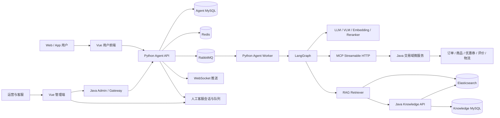
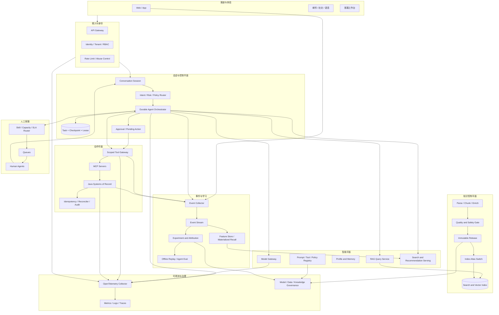

# AI Shop 电商智能客服与购物 Agent 成熟度审计报告

> 审计日期：2026-07-30
>
> 审计对象：`AI_Shop` 当前工作区，分支 `feature/rag`
>
> 审计范围：智能客服 Agent、任务编排、工具调用、RAG 与知识库、人工客服、商品搜索与推荐、可观测性、安全治理、测试与生产准备度
>
> 结论性质：基于代码、配置、测试和公开行业资料的工程审计，不等同于真实生产流量下的容量、安全或业务效果认证

## 1. 执行摘要

### 1.1 总体结论

当前系统已经明显超过“聊天机器人 Demo”阶段，具备一套较完整的垂直电商 Agent 骨架：

- 前台与管理端均已接入智能客服场景。
- Python Agent 服务与 Java 交易域微服务分离。
- 使用 LangGraph 显式编排会话节点。
- 通过 RabbitMQ、MySQL 和 Redis 处理异步任务、锁和部分恢复。
- 工具分为只读和写操作提案，写操作必须由用户确认后执行。
- 已具备混合检索、RRF、重排、查询改写、查询扩展、引用信息和基础 RAG 评测。
- 已具备转人工、排队、认领、回复、解决、SLA 统计和管理端操作界面。
- 已具备商品搜索、历史偏好、共购召回和 MMR 多样性。
- 已配置 Prometheus、Grafana、OpenTelemetry 和较丰富的自动化测试。

但系统还没有形成企业级 Agent 所要求的关键闭环：

1. **任务状态不可信**：模型生成或收尾失败可以被转换成面向用户的错误文案，随后任务仍被标记为 `COMPLETED`。
2. **恢复语义不完整**：失败时 checkpoint 仍会删除，Redis checkpoint 写入失败又是静默降级，不能证明任务可恢复。
3. **知识发布非原子**：新版本知识分批直接写入在线索引，发布中途失败可能留下部分新数据。
4. **RAG 缓存存在正确性缺陷**：缓存键未包含过滤条件、`top_k`、重排配置和 A/B 策略，可能跨策略返回错误结果。
5. **跨进程可观测性断裂**：API 与 Worker 是独立进程，但 Worker 未初始化完整 telemetry，Prometheus 只抓 API，关键任务指标可能不可见。
6. **人工路由仍是基础队列**：缺少数据库唯一约束、技能、容量、班组、渠道、语言和动态 SLA 路由。
7. **推荐没有效果归因**：有曝光日志但没有完整点击、加购、成交和推荐请求归因，无法计算真实 CTR、转化率和增量收益。
8. **评测数据尚不能作为发布门禁**：RAG golden 文件仍明确包含需替换的占位 ID，缺少真实业务轨迹、工具副作用和故障恢复评测。

### 1.2 成熟度评分

**综合评分：56/100，约 2.8/5。**

对应阶段：**工程化 MVP 后期，接近受控试运行，不建议直接作为企业级高流量核心客服系统全面放量。**

评分口径：

| 等级 | 定义 |
|---|---|
| 1 | 原型或单点 Demo，主要验证模型能力 |
| 2 | 工程化 MVP，有真实集成但可靠性闭环不足 |
| 3 | 可受控生产，核心状态、恢复、监控和评测基本闭环 |
| 4 | 企业成熟，具备规模化、治理、路由、审计和持续优化能力 |
| 5 | 行业领先，具备自动优化、精细实验和跨渠道智能运营能力 |

### 1.3 上线建议

| 场景 | 建议 |
|---|---|
| 内部演示、开发联调 | 可用 |
| 小规模白名单、低风险咨询 | 修复 P0-1 至 P0-4 后可灰度 |
| 涉及退款、收货、评价等交易动作 | 必须完成任务状态、恢复、审计和幂等验收后灰度 |
| 高流量全量客服 | 当前不建议 |
| 作为核心个性化导购和推荐增长引擎 | 当前数据闭环不足，不建议据此判断业务收益 |

## 2. 审计方法与边界

### 2.1 已执行工作

- 盘点仓库模块、运行方式、数据层、消息队列、Agent 图、MCP 工具和前后端交互。
- 阅读 Agent 主链路、Worker、任务状态、checkpoint、工具策略、确认动作、RAG、知识发布、人工客服、推荐和 telemetry 代码。
- 对照 Google Cloud、Salesforce、Microsoft、Zendesk、Intercom、Gorgias、AWS 等公开产品与架构资料。
- 对照 LangGraph、OpenAI Agents SDK、Google ADK、Microsoft Agent Framework、OpenTelemetry、OWASP、MCP 和 NIST 等官方资料。
- 对照 `tau-bench`、CRMArena-Pro、ECom-Bench、ShoppingBench 等 Agent 评测工作。
- 运行 Python、Java、Web 和 Admin 自动化测试及生产构建。

### 2.2 未覆盖或无法证明的内容

- 未启动包含 MySQL、Redis、RabbitMQ、Elasticsearch、全部 Java 服务和真实模型的完整环境。
- 未执行真实模型质量评测、长时间压测、峰值容量测试、混沌测试和安全渗透测试。
- 未验证第三方模型、Embedding、Reranker 和 VLM 在实际部署环境中的 SLA 与费用。
- 未审计生产数据库中的真实数据规模、索引规模、知识质量、客服排班和用户行为事件完整率。
- 未将工作区已有未提交改动回退或重写；本报告按当前文件内容审计。

因此，本报告可以判断“代码中是否具备某项机制”和“明显的设计风险”，不能替代真实生产验收。

## 3. 主流成熟架构研究

### 3.1 行业共同演进方向

成熟电商客服与购物 Agent 通常不是单一 LLM 加若干 API，而是分成十个相互约束的平面：

1. **渠道与体验层**：Web、App、邮件、社交渠道、语音和坐席工作台统一接入。
2. **身份与会话层**：登录身份、租户、会话状态、历史事件和长期记忆相互分离。
3. **分类与策略层**：意图、风险、语言、情绪、业务线、优先级和合规策略先于自由生成。
4. **Agent 编排层**：显式工作流、有限循环、可暂停、可恢复、可重放、可人工介入。
5. **知识与检索层**：文档治理、版本发布、混合召回、重排、引用、有效期和发布评测。
6. **动作与交易层**：最小权限工具、参数约束、审批、幂等、补偿、审计和系统记录校验。
7. **工单与人工层**：队列、技能、容量、班组、SLA、升级、回退、会话摘要和上下文移交。
8. **商品与推荐层**：目录、库存、价格、搜索、实时行为、归因 token、实验和转化评价。
9. **可观测与评测层**：全链路 trace、模型与工具 span、token/成本、离线评测、在线业务指标。
10. **治理控制层**：RBAC、数据保留、隐私、内容来源、红队、模型版本、提示词和策略发布。

Google 的商业搜索资料将商品目录、用户事件、搜索和推荐视为同一数据闭环；Salesforce 的购物 Agent 覆盖商品发现、历史订单、复购和订单状态；Gorgias 将电商客服、销售、工单和外部动作放在统一产品中。Zendesk 与 AWS 的客服路由则重点处理可用状态、容量、技能、队列优先级和跨渠道并发。[1][2][3][4][5]

### 3.2 成熟 Agent 运行时的共同要求

主流 Agent 框架都在强化以下能力：

- 会话、状态和长期记忆分层。
- checkpoint 与 durable execution。
- 人工中断、审批和恢复。
- 工具、handoff 与 guardrail 的显式边界。
- 完整记录模型生成、工具调用、handoff 和安全检查的 trace。
- 在 CI/CD 中运行 Agent 轨迹评测，而不仅是普通单元测试。

LangGraph 明确将 persistence 用于故障恢复和中断续跑，并提醒节点重放时副作用必须幂等；OpenAI Agents SDK 将 tracing、guardrails、handoffs 和 sessions 作为运行时能力；Google ADK 区分 session、state、events 与跨会话 memory，并支持将评测接入 CI/CD；Microsoft Agent Framework 强调显式 workflow、类型安全、telemetry 和长流程状态管理。[6][7][8][9]

### 3.3 成熟 RAG 的共同要求

成熟 RAG 已从“向量库 top-k”演进到完整知识工程：

- 文档解析、结构识别和语义 chunking。
- 元数据、权限、有效期和版本。
- Query rewrite、拆分或扩展。
- 关键词与向量混合召回。
- RRF 或可校准的融合。
- Reranker。
- 引用、拒答和证据门槛。
- 离线召回与端到端忠实度评测。
- 索引版本、影子构建、原子切换和回滚。

Azure 的高级 RAG 指南包含 chunking、查询改写、策略检查和多阶段检索；Elastic 推荐以 RRF 融合全文与向量结果；Anthropic 的 Contextual Retrieval 在索引前为 chunk 补充上下文；RAGAS 将检索质量、上下文相关性、回答相关性和忠实度分开评测。[10][11][12][13]

### 3.4 成熟工单路由的共同要求

成熟客服系统的 routing key 不只是“意图队列”：

- 渠道。
- 语言。
- 产品或业务线。
- 用户等级。
- 任务风险与复杂度。
- 紧急度和预计 SLA。
- 坐席技能与熟练度。
- 坐席在线状态。
- 当前容量和并发。
- 队列等待时长。
- 班组与工作时间。

Zendesk 的全渠道路由综合可用状态、容量、优先级、SLA 和技能；AWS Connect 的 routing profile 将队列、渠道、优先级、跨渠道并发和每坐席容量统一配置，并支持 proficiency-based routing。[3][5]

### 3.5 成熟推荐系统的共同要求

成熟推荐系统必须同时具备 serving 和 learning 两条链路：

- Serving：候选召回、业务约束、排序、多样性和实时上下文。
- Learning：曝光、点击、收藏、加购、购买、退货、负反馈和延迟转化。
- Attribution：推荐请求 ID、模型/策略版本、位置、实验组和 attribution token。
- Evaluation：Recall、NDCG、coverage、diversity、CTR、CVR、GMV、毛利和长期价值。

Google AI Commerce Search 要求记录实时用户事件，并将服务返回的 attribution token 带入后续事件；Amazon Personalize 同样依赖实时交互事件，并将在线指标和归因报告作为评估推荐影响的基础。[14][15]

### 3.6 安全与治理共同要求

成熟垂直 Agent 不把安全寄托在提示词上。常见控制包括：

- 工具最小权限和 allowlist。
- 用户身份由受信任上下文绑定，不能由模型决定。
- 写操作审批和可撤销设计。
- 结构化参数与后端再次校验。
- 对用户输入、RAG 文档、工具结果分别建信任边界。
- 处理间接提示注入。
- OAuth scope、audience binding、短期 token 和审计。
- 红队、事件披露、模型与策略版本治理。

OWASP 将 Prompt Injection 和 Excessive Agency 列为 Agent 应用核心风险；MCP 授权规范强调资源受众校验、禁止 token passthrough 和 OAuth 2.1 安全实践；NIST GenAI Profile 要求在整个 AI 生命周期内执行 Govern、Map、Measure、Manage；OpenAI 的 Agent 实践建议从单 Agent 开始，在需要时再演进多 Agent，并在输入、工具和人工介入环节部署 guardrail。[16][17][18][19]

## 4. 垂直电商 Agent 与通用助手的本质差异

| 维度 | 通用助手 | 电商客服与购物 Agent |
|---|---|---|
| 真相来源 | 模型知识和开放搜索可占较大比重 | 价格、库存、订单、物流、券和售后状态必须来自系统记录 |
| 错误代价 | 多数是答案质量下降 | 可能导致资金损失、错误退款、泄露订单、违背政策或客诉 |
| 状态 | 对话上下文为主 | 会话、任务、工单、交易动作、审批和业务对象状态并存 |
| 工具调用 | 可偏探索式 | 必须最小权限、强参数校验、幂等、审批和审计 |
| 知识时效 | 容忍一定滞后 | 政策、生效期、促销、库存和物流必须及时且可追溯 |
| 人工协作 | 可选 | 高风险、负面情绪、争议和复杂问题必须可靠移交 |
| 评价方式 | 有用性、自然度 | 还需规则遵循、任务成功、无副作用、SLA、成本和业务增量 |
| 个性化 | 可使用宽泛偏好 | 需处理用户授权、来源、衰减、删除和敏感属性 |
| 可观测性 | 请求级日志可能足够 | 必须跨模型、队列、Worker、工具和微服务追踪 |
| 生产策略 | 模型升级即可明显改善 | 模型只是一个组件，流程和数据闭环决定上限 |

因此，当前系统下一阶段最重要的不是增加更多“自主规划”或多 Agent，而是把状态真实性、恢复、知识发布、事件归因和运营路由做成确定性基础设施。

## 5. 当前系统架构概览

### 5.1 已形成的关键边界

- Python Agent 负责模型、编排、RAG、会话和客服任务。
- Java 微服务继续作为商品、订单、物流、优惠券和评价等业务事实源。
- MCP 工具作为 Agent 到业务服务的统一动作边界。
- 写操作不直接交给模型，而是先生成待确认动作。
- RAG 检索和知识发布分属 Python 查询侧与 Java 管理侧。

这个方向是正确的，主要问题集中在边界之间的状态契约、版本契约、身份契约和可观测契约还不够严格。

## 6. 分维度成熟度评分

| 维度 | 权重 | 评分 | 加权得分 | 判断 |
|---|---:|---:|---:|---|
| 业务架构与服务边界 | 10% | 3.5/5 | 7.0 | 微服务和 Agent 边界清楚，契约治理不足 |
| Agent 编排与持久化 | 15% | 2.3/5 | 6.9 | 有图、有任务、有 checkpoint，但失败与恢复语义存在关键缺陷 |
| 工具安全与交易控制 | 12% | 3.6/5 | 8.6 | 提案确认、身份覆写和幂等较扎实，缺恢复和更细授权 |
| RAG 与知识工程 | 15% | 2.7/5 | 8.1 | 检索能力较丰富，发布、缓存、数据与评测闭环不足 |
| 人工客服与工单路由 | 10% | 2.7/5 | 5.4 | 已有完整基础生命周期，仍停留在静态队列 |
| 商品搜索与推荐 | 10% | 2.5/5 | 5.0 | 有召回和多样性，缺事件、归因、训练和在线评价 |
| 可观测性与 SRE | 10% | 2.3/5 | 4.6 | 有组件，但跨进程和跨语言链路未真正闭环 |
| 评测与测试工程 | 8% | 2.8/5 | 4.5 | 单元测试数量可观，真实依赖、轨迹、故障和效果评测不足 |
| 安全、隐私与治理 | 7% | 2.7/5 | 3.8 | 有纵深防护意识，RBAC、数据治理和红队仍不足 |
| 产品体验与运营能力 | 3% | 3.0/5 | 1.8 | 用户端、客服端和反馈入口基本具备 |
| **合计** | **100%** | **2.8/5** | **55.7/100** | **取整 56/100** |

## 7. 详细代码审计

### 7.1 Agent 编排与任务可靠性

#### 已有能力

- `app/graph/builder.py:52-84` 使用显式节点和边定义 LangGraph。
- `app/graph/state.py:9-45` 定义统一 graph state。
- `app/services/agent_service.py:188-207` 先持久化任务再投递 MQ，方向优于仅依赖队列消息。
- `app/services/agent_queue_service.py:57-91` 使用 durable exchange、业务队列和 DLQ。
- `app/worker.py:99-121` 有待处理和失败任务恢复扫描。
- `app/worker.py:157-168` 有用户级并发锁，避免同一用户多轮同时执行。

#### 关键缺陷

**A. 任务可能“业务失败但状态成功”。**

- `app/graph/nodes.py:358-395` 在 LLM 无响应或异常时，向用户推送错误消息，但返回 `finished=True` 和结束路由。
- `app/graph/nodes.py:563-635` finalize 与 post-turn 捕获异常后继续结束。
- `app/worker.py:177-187` 在 `assistant_answer` 返回后无条件 `mark_completed`。

结果是运维指标中的完成率不能代表真实用户任务成功率，重试机制也不会接管这些失败。

**B. checkpoint 在失败后仍被删除。**

- `app/graph/runner.py:61-66` 在 `finally` 中无条件删除 checkpoint。
- `app/graph/runner.py:15-37` 虽然定义了 resume 判断，但删除行为使多数异常无法真正续跑。

**C. checkpoint 持久化是 fail-open。**

- `app/graph/checkpoint/redis_saver.py:161-195` Redis 写入和删除失败只记录日志，不向调用方传播。
- 进程内 saver 仍可能让当前进程继续成功，重启后却失去恢复数据。

**D. 锁和任务 claim 缺少 lease/fencing。**

- `app/worker.py:157-168` 用户锁 TTL 固定且无续租。
- `app/services/task_service.py:66-86` 允许重新 claim `PROCESSING` 任务，缺少 owner、lease expiry 和 fencing token。
- 当 MQ 重投、Worker 卡顿或任务超过 TTL 时，可能出现并发执行。

**E. 重试缺少退避。**

- `app/worker.py:236-261` 失败后立即重新发布，没有指数退避、抖动和延迟队列。
- 下游故障时容易形成重试风暴。

**F. 工具调用按顺序执行。**

- `app/graph/nodes.py:472-520` 对一组工具调用逐个等待。
- 对相互独立的只读工具会增加尾延迟；写工具仍应保持串行和强约束。

#### 判断

编排结构已成型，但 durable execution 的关键不是“存在 checkpoint”，而是能证明：

- 哪个状态是权威状态。
- 哪种失败会重试。
- 重试从哪里恢复。
- 节点重放是否幂等。
- 最终状态是否等于真实用户结果。

当前尚未达到这一标准。

### 7.2 工具安全、审批与交易语义

#### 已有能力

- `app/domain/tool_policy.py:65-88` 将工具白名单和风险等级收敛为单一策略表。
- 表外工具默认拒绝，只区分只读和写提案。
- `app/services/mcp_tool_router.py:32-48` 先检测模型声明的 userId，再强制用认证上下文覆盖。
- `app/services/mcp_tool_router.py:50-58` 为写工具记录审计日志。
- `app/services/pending_action_service.py:69-120` 使用 Redis 锁和数据库 claim 防止重复确认。
- `app/services/pending_action_store.py` 使用受状态约束的 SQL 将 `PENDING` 抢占为 `EXECUTING`。
- 输入防护会做 NFKC、控制字符清理、长度限制、注入启发式和伪造 action token 清理。
- 输出防护会清理伪造完成、伪造确认卡片、伪造能力和嵌入商品 JSON。
- Prompt 明确禁止代下单、采集地址和联系方式，并要求写操作走 `PROPOSE_*`。

这是本系统最成熟的部分之一，符合垂直 Agent “模型提议，系统授权，用户确认，后端执行”的基本原则。

#### 缺口

**A. `EXECUTING` 动作缺少恢复器。**

Worker 或下游服务在执行后、写最终状态前崩溃，动作可能长期停留在 `EXECUTING`。当前 Agent task 有恢复扫描，但 pending action 没有对应 reconciler。

**B. 远程 MCP 主要依赖内部服务凭证。**

服务端绑定 userId 能阻止模型跨用户调用，但仍建议为生产环境补充：

- 服务身份和用户委托身份分离。
- tool scope。
- token audience。
- 管理动作与用户动作不同角色。
- 每次动作的 trace、request ID 和 idempotency key。

**C. 间接提示注入评测不足。**

现有输入 guard 主要针对用户直接输入。RAG 文档、商品文本、工具返回也都属于不可信数据，应增加“工具结果诱导调用其他工具、泄露信息或绕过审批”的专门测试。

**D. 输出 guard 仍以文本模式为主。**

长期应将“是否完成、是否需要确认、业务卡片类型、动作 token”放入结构化响应协议，由渲染层消费，而不是依赖正文正则纠错。

### 7.3 RAG 检索与知识库

#### 已有能力

- `app/rag/retriever.py:93-130` 支持 FAQ 快速路径和混合检索。
- `app/rag/retriever.py:221-246` 支持查询扩展、BM25、向量召回、RRF 和 rerank。
- `app/rag/retriever.py:293-361` 处理向量相似度和候选池。
- `app/rag/retriever.py:363-416` 支持 reranker。
- `app/rag/retriever.py:501-572` 生成 trace 和 source references。
- `app/rag/retriever.py:668-688` 有证据门槛和拒答逻辑。
- `app/rag/query_rewriter.py` 与 `query_expander.py` 提供查询改写和扩展。
- `app/rag/ab_test.py` 提供稳定分桶和配置覆盖。
- `app/rag/evaluation.py`、`scripts/eval_rag.py` 和 `scripts/eval_ragas.py` 已覆盖检索与生成维度。
- Java 知识侧支持 TXT、Markdown、PDF、DOCX、图片描述和上下文前缀。

这些能力组合已经接近现代 RAG pipeline，而不是简单向量搜索。

#### P0 正确性问题

**A. 语义缓存键不完整。**

`app/rag/retriever.py:113-128` 的缓存键主要由知识版本和改写后 query 组成，未包含：

- `top_k`
- category/filter
- A/B bucket 或策略
- query expansion 开关
- reranker 模型和版本
- 阈值配置

同一 query 的第一次请求可能污染另一种过滤条件或实验策略。该问题会直接导致错误证据进入回答。

**B. 知识发布不是原子发布。**

`KnowledgeBaseServiceImpl.java:102-180` 分批直接写在线向量存储，然后更新文档状态和知识版本。中途失败可能留下：

- 部分新 chunk 已在线。
- 文档仍显示未发布。
- 查询端看见混合版本。
- 无法一键回滚到上一完整版本。

归档流程 `KnowledgeBaseServiceImpl.java:187-206` 也先删向量再更新数据库，同样可能部分完成。

#### 其他重要问题

**C. Enrichment 在激活后异步发生。**

`KnowledgeBaseServiceImpl.java:148-155` 在初次索引后异步补上下文。相同知识版本的检索结果会随后台任务逐渐变化，难以审计、复现和做 A/B 对照。

**D. chunk 策略偏固定。**

`KnowledgeDocumentParser.java:174-202` 主要使用固定 1200 字符和 120 overlap，并只做有限的 Markdown 标题识别。政策条款、表格、列表、FAQ 和商品规格应采用不同结构策略。

**E. VLM 上传链路可能阻塞且超时配置未生效。**

- `KnowledgeDocumentParser.java:56-80` 在上传解析时同步描述最多 10 张图片。
- `ImageVlmDescriber.java:58-59` 有 timeout 字段，但 `RestClient` 请求未实际使用它。
- `ImageVlmDescriber.java:103-105` 固定声明 `image/png`，不区分真实格式。
- `ImageVlmDescriber.java:107-110` 每张图新建 client。
- `RagEnricherConfig.java:22-33` 使用 `CallerRunsPolicy`，队列满时可能把昂贵 enrichment 压回发布请求线程。

**F. 有效期过滤时机偏晚。**

`app/rag/retriever.py:690-711` 在合并并限量后再过滤过期 FAQ，过期项可能先占据 top-k，导致有效文档召回不足。应尽可能下推到 Elasticsearch query filter。

**G. 意图到知识分类的映射覆盖有限。**

`app/graph/nodes.py:164-180` 主要只在 `PRODUCT_CONSULT` 和 `CHAT` 预取 RAG；默认 category map 又为空。退款、物流、售后等知识分类配置可能在常见意图上并未真正生效。

**H. Golden 数据仍含占位 ID。**

`scripts/rag_golden.jsonl` 首行明确提示需用目标知识发布中的 ID 替换占位值。当前门禁不能证明真实索引上的 Recall、MRR 和引用正确性。

### 7.4 人工客服与工单路由

#### 已有能力

- `app/services/support_service.py` 已覆盖创建、查询、认领、激活、回复、解决、取消和转回 AI。
- 支持移交会话历史和 WebSocket 通知。
- 支持 urgency、排队和基础 SLA 统计。
- 管理端 `AgentMessageList.vue` 已提供人工会话队列、SLA 标签、认领、激活、回复、解决和转回 AI。
- 已有反馈、badcase 和 FAQ candidate 闭环雏形。

#### 关键缺口

**A. “每用户一个活跃人工会话”未由数据库保证。**

- `support_service.py:42-87` 使用先查再插入。
- `current_agent_core.py:93-113` 没有对活跃会话建立唯一约束。

并发请求可能创建重复会话。应使用数据库唯一性、可重试插入或显式 active-session 表，而不是仅依赖应用层检查。

**B. 管理身份边界偏弱。**

Python 内部客服接口使用共享内部 token，并接收请求体中的 `adminId`。生产环境应从已认证的管理员身份和角色中派生 adminId，不能由调用方自由声明。

**C. 路由仍是静态排序队列。**

`support_service.py:266-301` 主要按状态、紧急度和创建时间排序，缺少：

- skill / proficiency
- language
- product line
- tenant / store
- agent availability
- current concurrency
- team shift
- predicted effort
- sentiment and risk
- SLA breach probability

**D. 缺少容量和超时后的自动重路由。**

成熟系统需要支持无人可接、容量耗尽、坐席离线、认领超时、首次响应超时和跨队列溢出的自动处理。

**E. 测试以纯函数为主。**

目前缺少并发创建、并发认领、客服权限、断线重连、SLA 升级和转回 AI 的完整集成测试。

### 7.5 商品搜索、推荐与购物助手

#### 已有能力

- `app/services/product_service.py:84-164` 支持混合商品搜索和重排。
- `app/services/product_service.py:205-233` 有库存和用户画像硬约束。
- `app/services/search_recommend_service.py:15-59` 支持分类偏好、购买历史和共购召回。
- `app/services/search_recommend_service.py:221-271` 使用 MMR 做品类多样性。
- `app/services/shopping_profile_service.py` 将用户画像持久化到 Redis 和 MySQL，并支持规则与 LLM enrichment。
- `app/services/product_service.py:235-241` 已记录推荐曝光。

#### 关键缺口

**A. 只有曝光，没有完整点击与成交归因。**

- `redis_service.py:161-183` 定义了点击记录方法，但仓库中没有调用方。
- `AgentProductList.vue:35-45` 点击商品只更新本地咨询商品，没有上报推荐点击事件。
- API 中没有推荐 click/add-to-cart/order attribution endpoint。

因此当前无法可靠计算：

- 推荐 CTR。
- 位置偏差。
- 搜索和推荐的来源差异。
- 加购率与购买转化率。
- 推荐带来的 GMV 或毛利。
- A/B 实验增量。

**B. 缺少推荐请求级标识。**

每次 serving 应返回：

- recommendation request ID
- strategy/model version
- experiment ID
- source
- rank position
- attribution token

后续曝光、点击、加购、购买、退货事件必须携带这些字段。

**C. 共购召回在线计算方式不适合规模化。**

`OrderAgentInternalController.java:195-240` 先找包含 seed 商品的订单项，再逐订单查询全部商品并计数，形成 N+1 查询和在线聚合。应改为离线或流式构建 item-item 关联表。

**D. 画像缺少治理。**

当前画像会持续累积信号，但未看到明确的：

- 用户查看、重置或删除入口。
- 信号来源和置信度。
- 时间衰减。
- 会话偏好与长期偏好分层。
- 敏感属性限制。
- 用户授权状态。

**E. 缺少推荐评测与发布机制。**

现有测试主要验证 helper、fallback 和共购逻辑，没有离线 NDCG/Recall、coverage、冷启动、在线 CTR/CVR、实验显著性和模型版本回滚。

### 7.6 可观测性与全链路追踪

#### 已有能力

- `app/main.py:113-124` 为 API 初始化 telemetry 并暴露 `/metrics`。
- `app/observability/telemetry.py` 支持 OTLP，并自动 instrument FastAPI、HTTPX 和 Redis。
- `app/harness/metrics/runtime_sensors.py` 定义意图、RAG、LLM、熔断、工具、流式字符、任务和 backlog 指标。
- 已存在 Prometheus、Grafana dashboard 和告警规则。
- Java `TraceIdFilter` 与 `FeignTraceInterceptor` 支持 `X-Trace-Id`。

#### 关键缺口

**A. Worker 没有完整 telemetry 初始化。**

`app/worker.py` 作为独立进程运行，但未调用 API 中的 `configure_telemetry`，因此任务处理、LangGraph、LLM、MQ 和工具链路缺少完整 span。

**B. Worker 指标可能没有被 Prometheus 抓取。**

- `deploy/prometheus/prometheus.yml:53-58` 只抓取 Agent API 的 7050 端口。
- Worker 是独立进程。
- 多数任务计数器和 inflight 指标在 Worker 内更新。

如果没有 multiprocess collector、Worker metrics endpoint 或统一 push/OTLP 指标出口，Dashboard 上的任务指标并不代表真实 Worker。

**C. trace context 跨 MQ 和 Python/Java 断裂。**

- MQ header 只有 `x-message-id`，没有 W3C `traceparent`。
- Python `java_internal_client.py` 只发送内部 token。
- Java 内部使用 `X-Trace-Id`，Python 业务 `trace_id` 又是另一套值。

一个用户请求无法稳定关联：

`HTTP -> DB task -> MQ publish -> Worker consume -> LangGraph -> LLM -> MCP -> Java -> DB/ES`

**D. token 指标实际是字符数。**

`agent_runtime.py:92-120` 中 `STREAM_TOKENS.inc(len(delta))` 统计的是字符，不是模型 token。它不能用于成本、吞吐或配额判断。

**E. 缺少 Agent 特有指标。**

建议补充：

- time to first token
- total generation latency
- prompt/completion/cached token
- model cost
- tool latency and retry
- graph node latency
- checkpoint persist/recover result
- task outcome
- handoff reason
- RAG citation coverage
- policy violation
- confirmation conversion
- false completion

OpenTelemetry 已定义 messaging、database、GenAI 和 Agent 相关 semantic conventions；跨进程 context propagation 是把这些 span 组装成同一 trace 的基础。[20]

### 7.7 安全、隐私与治理

#### 已有能力

- 输入归一化、长度限制和提示注入启发式。
- Prompt boundary 对用户输入和知识片段做数据边界隔离。
- 工具 allowlist。
- 用户身份后端绑定。
- 写操作仅提案并要求确认。
- 输出虚假完成检查。
- 严重负面情绪和转人工规则。
- 不代下单、不收集地址和联系方式。

#### 需要补齐

- 对 RAG、商品文本和工具结果做间接注入测试。
- 管理端和内部 Agent API 的细粒度 RBAC。
- 数据保留周期、删除、导出和访问审计。
- 用户画像的授权与可撤回。
- 知识来源、所有者、审批人和发布记录。
- 提示词、工具 schema、模型和策略版本登记。
- 模型供应商数据使用策略和敏感数据脱敏。
- 自动红队、滥用检测和安全事件响应流程。
- MCP 服务身份、scope 和 token audience。
- 高风险动作的双重确认、限额或人工审核策略。

### 7.8 测试与工程质量

#### 本次实际验证结果

| 范围 | 命令 | 结果 |
|---|---|---|
| Python Agent | `.venv/bin/python -m pytest -q` | `291 passed, 1 skipped` |
| Python 静态检查 | `.venv/bin/python -m ruff check .` | 通过 |
| Python 编译检查 | `.venv/bin/python -m compileall` | 通过 |
| Java 全 Reactor | `mvn test -DskipTests=false` | 26 模块成功，85 tests，BUILD SUCCESS |
| 用户前端 | `npm test -- --run` | 4 files，9 tests 通过 |
| 用户前端 | `npm run build` | 生产构建通过，bundle budget 通过 |
| 管理端 | `npm test -- --run` | 1 file，5 tests 通过 |
| 管理端 | `npm run build` | 生产构建通过，bundle budget 通过 |

合计可见测试结果为 **390 项通过，1 项跳过**。

#### 发现的工程问题

- `.venv/bin/pytest` 的 shebang 仍指向旧仓库路径，直接运行失败；通过 `.venv/bin/python -m pytest` 可正常执行。
- 跳过的是依赖真实 MySQL 的迁移集成测试。
- Java 测试出现 Mockito 动态 self-attach 和 Commons Logging 冲突警告。
- 管理端构建出现大于 400 KB chunk 警告，最大 chunk 约 1.12 MB minified。
- 搜索服务约只有 5 个直接相关测试，缺少知识发布回滚、分批失败、enrichment、VLM 和索引版本测试。
- 用户前端存在 E2E smoke 文件，但本次未启动完整栈执行。

#### 测试覆盖的主要空白

- Redis/RabbitMQ/MySQL/ES 全依赖集成。
- MQ 重投和并发 Worker。
- checkpoint 写失败、进程崩溃和恢复。
- 写动作执行后崩溃的对账。
- 知识发布中途失败和回滚。
- 并发人工会话与客服权限。
- RAG 真实发布版本评测。
- Agent 轨迹、策略遵循和工具副作用。
- 间接提示注入。
- 峰值、长稳、降级和成本测试。

Agent 领域已有更贴近生产的评测范式：`tau-bench` 评估多轮用户交互、工具和领域规则；CRMArena-Pro 评估真实企业任务；ECom-Bench 聚焦多模态电商客服；ShoppingBench 聚焦复杂购物意图和端到端执行。它们共同说明，仅测试最终文本不足以判断 Agent 是否可上线。[21][22][23][24]

## 8. P0、P1、P2 优先级

### 8.1 P0：扩大生产流量前必须完成

| ID | 问题 | 直接影响 | 建议方案 | 验收标准 |
|---|---|---|---|---|
| P0-1 | 任务失败仍标记完成 | 指标失真、无法重试、用户错误被当成功 | 定义 `AgentRunOutcome`：`SUCCEEDED`、`HANDOFF`、`RETRYABLE_FAILED`、`TERMINAL_FAILED`、`CANCELLED`；Worker 按 outcome 转状态 | 注入 LLM、finalize、tool、push 故障后，DB 状态和用户结果一致；任何失败不得进入成功率 |
| P0-2 | checkpoint、锁和重投语义不可靠 | 重复执行或无法恢复 | 失败不删 checkpoint；checkpoint 写失败可见且阻止宣称可恢复；任务增加 `lease_owner`、`lease_until`、fencing token 和 heartbeat；重试用退避与抖动 | Kill Worker 后任务可恢复；同一任务任何时刻只有一个有效 owner；副作用最多一次或可安全重放 |
| P0-3 | Worker 与跨服务观测断裂 | 线上故障无法定位，Dashboard 误导 | Worker 初始化 OTel；为 Worker 暴露 metrics 或采用 multiprocess/OTLP；MQ 注入/提取 `traceparent`；统一 Python 和 Java trace | 一条请求可在 trace 中贯穿 API、MQ、Worker、LLM、MCP、Java；任务指标与 DB 抽样一致 |
| P0-4 | RAG 缓存键错误 | 不同过滤和实验互相污染 | 缓存键加入知识 release、原始/改写 query、filters、top_k、strategy、bucket、reranker/model/config hash；不同用户个性化结果禁止共享 | 单测覆盖不同 filter、top_k、A/B、reranker；交叉请求无缓存串扰 |
| P0-5 | 知识发布非原子 | 在线知识混合版本，无法回滚 | 构建 release manifest 和 shadow index；解析、enrich、embedding、验证全部完成后 alias 原子切换；保留上一版本回滚 | 任意批次失败时在线 alias 不变；一次操作可回滚；回答可追溯到 immutable release |
| P0-6 | 人工会话并发和管理员身份不可信 | 重复工单、越权或错误归属 | 数据库保证每用户/租户单一活跃会话；claim 使用条件更新；adminId 从认证主体派生；接口做角色校验 | 并发 100 次创建只生成一个活跃会话；伪造 adminId 无效；认领无双 owner |
| P0-7 | 推荐事件与归因缺失 | 无法判断推荐是否有效，也无法安全做 A/B | 建立统一事件 schema 和上报 API；曝光、点击、加购、购买、退货携带 request ID、position、strategy、experiment、attribution token | 曝光覆盖率 >99%，点击归因率 >98%，订单可回溯到推荐请求；可产出 CTR/CVR/GMV 报表 |

### 8.2 P1：形成受控生产闭环

| ID | 工作项 | 目标 |
|---|---|---|
| P1-1 | pending action reconciler | 处理长期 `EXECUTING`，查询下游幂等结果后补终态或人工介入 |
| P1-2 | 技能与容量路由 | 按语言、产品、风险、技能、在线状态、并发和 SLA 动态分配 |
| P1-3 | SLA 自动升级 | 支持即将超时、已超时、无人可接和队列拥塞的自动升优先级与溢出 |
| P1-4 | 全栈集成与故障注入 | 在 CI 中启动 MySQL、Redis、RabbitMQ、ES，覆盖 crash、timeout、redelivery |
| P1-5 | 真实 Agent 轨迹评测 | 检查最终答案、工具选择、参数、规则、状态变更和无额外副作用 |
| P1-6 | 真实 RAG release gate | 使用真实 document/chunk ID，按场景分层评测 Recall、MRR、faithfulness、拒答 |
| P1-7 | 推荐离线管道 | 将共购和用户特征改为离线/流式物化，建立模型或策略版本 |
| P1-8 | 用户画像治理 | 来源、置信度、衰减、会话/长期分层、查看、重置、删除和授权 |
| P1-9 | 成本与性能预算 | TTFT、总延迟、token、调用次数、缓存命中、每会话成本和每成功任务成本 |
| P1-10 | 安全红队与数据治理 | 间接注入、跨用户、越权、数据泄露、工具诱导、保留和事件响应 |

### 8.3 P2：规模化和差异化能力

| ID | 工作项 | 前置条件 |
|---|---|---|
| P2-1 | 专家 Agent 或 manager-worker 模式 | 单 Agent 的质量瓶颈已由评测证明，而非仅因架构偏好 |
| P2-2 | 多模型网关 | 已有质量、延迟、成本和 fallback 数据可驱动路由 |
| P2-3 | Agentic retrieval 并行子查询 | 已建立端到端预算、并发限制和收益评测 |
| P2-4 | 知识自动质检与运营看板 | release、来源和 badcase 数据已结构化 |
| P2-5 | 推荐学习排序与 bandit | 事件归因、实验平台和业务 guardrail 已完整 |
| P2-6 | 多渠道客服 | 核心会话和路由模型已支持渠道与容量 |
| P2-7 | 主动服务 | 用户授权、频控、触达策略和归因机制已就绪 |
| P2-8 | 自动化策略优化 | 具备安全沙箱、离线 replay、canary 和人工审批 |

## 9. 分阶段演进路线图

### 阶段 A：0-2 周，先让状态和数据可信

交付：

1. `AgentRunOutcome` 和统一状态机。
2. 修复 checkpoint 删除和 Redis fail-open。
3. 修复 RAG cache key。
4. 人工活跃会话唯一约束和管理员身份绑定。
5. Worker metrics/trace 最小闭环。
6. 推荐事件 API、request ID 和前端点击埋点。
7. 将 RAG golden 占位 ID 替换为真实 release ID。

阶段门禁：

- 故障注入下不再出现“失败任务标记完成”。
- 无重复人工会话。
- 无 RAG 策略缓存串扰。
- 能查询 Worker 的真实任务成功率和失败原因。

### 阶段 B：3-6 周，形成可恢复生产闭环

交付：

1. task lease、heartbeat、fencing 和指数退避。
2. pending action reconciler。
3. knowledge release、shadow index、alias switch 和 rollback。
4. 全栈集成测试环境。
5. MQ、MCP、Java 全链路 trace context。
6. 第一版技能、容量和 SLA 路由。
7. 推荐曝光、点击、加购、订单、退货归因报表。

阶段门禁：

- Worker 强杀、Redis 短故障、MQ 重投和下游超时均有确定结果。
- 知识发布中途失败不影响在线版本。
- 交易动作无重复副作用。
- 关键链路 trace 覆盖率达到 95% 以上。

### 阶段 C：7-12 周，建立质量和增长系统

交付：

1. `tau-bench` 风格的多轮用户模拟和工具轨迹评测。
2. 电商客服场景集：订单、物流、退款、评价、优惠券、售后、争议、转人工。
3. RAG release gate 和 badcase 自动回灌。
4. 推荐离线特征、item-item 物化和实验平台。
5. 用户画像治理与衰减。
6. 安全红队和间接提示注入集。
7. TTFT、token、成本、任务成功和客服 SLA 的统一看板。

阶段门禁：

- 每次模型、Prompt、工具 schema、知识 release 和推荐策略变更都可离线回放。
- 质量门禁不只检查文本，还检查工具、状态和副作用。
- A/B 结果可基于真实归因判断，而不是仅比较模型主观评分。

### 阶段 D：3-6 个月，企业化与规模化

交付：

1. 多渠道客服和 Workforce/routing 能力。
2. 多租户、门店、班组、角色和数据隔离。
3. 多模型路由、成本预算和供应商降级。
4. 专家 Agent 或可组合 workflow。
5. 推荐学习排序、实时特征和长期价值优化。
6. 模型、知识、Prompt、策略和数据治理控制面。
7. 容量、混沌、灾备和安全认证。

阶段门禁：

- 在目标峰值流量下满足 SLO。
- 关键业务有明确 RTO/RPO。
- 审计可回答“哪个用户、哪个 Agent 版本、基于哪版知识、调用了什么工具、产生了什么结果”。

## 10. 建议目标架构

### 10.1 设计原则

- **确定性外壳，概率性内核**：模型负责理解、生成和有限规划；身份、权限、状态、交易和发布由确定性系统控制。
- **一切副作用可识别**：每个动作有 idempotency key、owner、状态机、审计和 reconciler。
- **一切版本可回放**：模型、Prompt、工具 schema、知识 release、推荐策略和实验组全部入 trace。
- **一切失败有归属**：区分用户输入失败、模型失败、检索失败、工具失败、下游失败、推送失败和人工超时。
- **单 Agent 优先**：只有评测证明专门化能带来收益时才引入多 Agent，避免提前增加路由和状态复杂度。
- **运营数据先于高级智能**：没有真实事件、归因和发布门禁时，不应优先做 bandit、自动优化或复杂多 Agent。

## 11. 建议指标、SLO 与发布门禁

以下是建议初始目标，需结合真实业务量和客服排班校准。

### 11.1 可靠性

| 指标 | 建议目标 |
|---|---:|
| Agent API 月可用性 | >= 99.9% |
| 已接收任务最终进入明确终态 | >= 99.99% |
| 失败被误标为成功 | 0 |
| 同一动作产生重复业务副作用 | 0 |
| checkpoint 可恢复率 | >= 99.9% |
| MQ redelivery 后状态一致率 | 100% |

### 11.2 性能与成本

| 指标 | 建议目标 |
|---|---:|
| FAQ 快速路径 P95 | <= 500 ms |
| 流式回答 TTFT P95 | <= 2.5 s |
| 简单客服回答完成 P95 | <= 8 s |
| 单次只读工具 P95 | 按业务服务 SLO，建议 <= 2 s |
| Agent 最大工具轮次 | 保持硬限制并监控触发率 |
| 每成功任务 token 与成本 | 建立分意图基线和预算告警 |

### 11.3 RAG

| 指标 | 建议初始门禁 |
|---|---:|
| Recall@5 | >= 0.85 |
| MRR | >= 0.75 |
| Citation coverage | >= 0.95 |
| Faithfulness | >= 0.90 |
| 应拒答场景正确拒答率 | >= 0.95 |
| 过期知识命中 | 0 |
| release 可回滚 | 100% |

### 11.4 工具与安全

| 指标 | 建议目标 |
|---|---:|
| 未授权工具执行 | 0 |
| 跨用户数据访问 | 0 |
| 未确认写操作 | 0 |
| action token 伪造成功 | 0 |
| 间接提示注入导致敏感动作 | 0 |
| 高风险动作审计覆盖率 | 100% |

### 11.5 人工客服

| 指标 | 建议 |
|---|---|
| 首次响应 SLA | 分 urgency、渠道和服务时段配置 |
| 排队超时率 | 单独监控并自动升级 |
| 转人工上下文完整率 | >= 99% |
| 重复活跃会话率 | 0 |
| 认领后未响应率 | 监控并触发 requeue |
| AI 转人工原因分布 | 必须可查询 |

### 11.6 推荐

| 指标 | 建议目标 |
|---|---:|
| 曝光事件覆盖率 | >= 99% |
| 点击归因率 | >= 98% |
| 订单归因完整率 | >= 95% |
| 离线 Recall/NDCG | 分场景与基线比较 |
| Coverage / Diversity | 设置业务 guardrail |
| 在线 CTR/CVR/GMV uplift | 使用随机实验与显著性判断 |
| 退货率、投诉率 | 作为推荐负向 guardrail |

## 12. 推荐的评测集结构

### 12.1 Agent 任务样本

每个样本至少包含：

- 初始数据库状态。
- 用户 persona 和真实目标。
- 允许的工具与政策。
- 多轮用户行为。
- 必须调用和禁止调用的工具。
- 参数约束。
- 期望最终业务状态。
- 允许的回答范围。
- 不允许出现的副作用。
- 是否应转人工。

### 12.2 评分维度

不要只用 LLM judge 判断“回答好不好”，还应执行确定性检查：

1. 任务是否完成。
2. 领域规则是否遵守。
3. 工具是否正确选择。
4. 参数是否正确。
5. 身份和权限是否正确。
6. 最终数据库状态是否正确。
7. 是否产生额外副作用。
8. 用户是否被要求提供不必要敏感信息。
9. 是否在需要时转人工。
10. 延迟、token 和费用是否在预算内。

### 12.3 故障场景

- 模型 timeout、429、5xx 和空响应。
- Embedding/Reranker/VLM 故障。
- Redis 短暂不可用。
- MQ 重复投递。
- Worker 执行中被 kill。
- 工具返回成功但响应丢失。
- 工具执行成功、最终状态写入失败。
- WebSocket 推送失败。
- Java 服务 timeout。
- Elasticsearch 部分写入失败。
- 知识发布中途失败。
- 坐席认领后离线。

## 13. 最终判断

### 13.1 值得保留并继续投资的部分

- Python Agent 与 Java 业务域的分层方向。
- LangGraph 显式编排。
- DB task 加 MQ 的异步模型。
- 工具策略单一事实源。
- userId 后端绑定。
- 写操作提案加用户确认。
- 混合 RAG、RRF、rerank、引用和评测脚本。
- 人工客服完整基础生命周期。
- 搜索、共购和 MMR 的推荐雏形。
- Prometheus、Grafana、OTel 和自动化测试基础。

### 13.2 不建议继续堆叠的方向

在 P0 完成前，不建议优先投入：

- 更多专家 Agent。
- 更长的自主循环。
- 自动代下单或更多直接写工具。
- 复杂 bandit 或强化学习推荐。
- 无版本约束的自动知识 enrichment。
- 仅靠 Prompt 增加更多安全规则。

这些功能会放大当前状态、恢复、观测和数据闭环问题。

### 13.3 最重要的工程判断

当前系统的主要瓶颈已经不是“模型会不会回答”，而是：

> 系统能否证明一次回答和动作基于正确身份、正确知识版本和真实业务状态；失败后能否恢复；线上是否能看到真实结果；效果是否能被可靠归因。

当 P0 全部完成、P1 的全栈测试与真实评测门禁落地后，系统可进入较稳健的受控生产阶段，成熟度预计可提升到 **3.4-3.7/5**。完成技能容量路由、知识 release、推荐学习闭环、跨渠道治理和规模化 SRE 后，才接近 **4/5 企业成熟级**。

## 14. 公开研究与产品资料

1. [Google Cloud AI Commerce Search documentation](https://docs.cloud.google.com/retail/docs)
2. [Salesforce Shopper Agent for B2C Commerce](https://help.salesforce.com/s/articleView?id=cc.b2c_agent_guided_shopping.htm&language=en_US&type=5)
3. [Zendesk omnichannel routing](https://support.zendesk.com/hc/en-us/articles/4409149119514-About-omnichannel-routing)
4. [Gorgias AI Agent and automation features](https://docs.gorgias.com/en-US/articles/ai-agent-and-automations-135134)
5. [Amazon Connect routing profiles](https://docs.aws.amazon.com/connect/latest/adminguide/routing-profiles.html)
6. [LangGraph persistence](https://docs.langchain.com/oss/python/langgraph/persistence)
7. [OpenAI Agents SDK tracing](https://openai.github.io/openai-agents-python/tracing/)
8. [Google ADK sessions](https://google.github.io/adk-docs/sessions/)
9. [Microsoft Agent Framework overview](https://learn.microsoft.com/en-us/agent-framework/overview/)
10. [Azure advanced RAG systems](https://learn.microsoft.com/en-us/azure/developer/ai/advanced-retrieval-augmented-generation)
11. [Elasticsearch hybrid search](https://www.elastic.co/docs/solutions/search/hybrid-search)
12. [Anthropic Contextual Retrieval](https://www.anthropic.com/engineering/contextual-retrieval)
13. [RAGAS paper, EACL 2024](https://aclanthology.org/2024.eacl-demo.16/)
14. [Google AI Commerce Search user events](https://docs.cloud.google.com/retail/docs/user-events)
15. [Amazon Personalize event metrics and attribution](https://docs.aws.amazon.com/personalize/latest/dg/event-metrics.html)
16. [OWASP LLM Prompt Injection](https://genai.owasp.org/llmrisk/llm01-prompt-injection/)
17. [MCP authorization security considerations](https://modelcontextprotocol.io/specification/2026-07-28/basic/authorization/security-considerations)
18. [NIST AI RMF Generative AI Profile](https://www.nist.gov/publications/artificial-intelligence-risk-management-framework-generative-artificial-intelligence)
19. [OpenAI practical guide to building agents](https://openai.com/business/guides-and-resources/a-practical-guide-to-building-ai-agents/)
20. [OpenTelemetry context propagation](https://opentelemetry.io/docs/concepts/context-propagation/)
21. [tau-bench](https://arxiv.org/abs/2406.12045)
22. [CRMArena-Pro](https://arxiv.org/abs/2505.18878)
23. [ECom-Bench](https://aclanthology.org/2025.emnlp-industry.19/)
24. [ShoppingBench](https://arxiv.org/abs/2508.04266)
