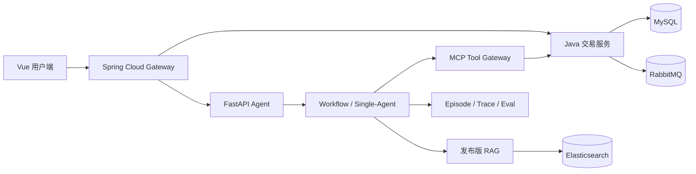

# 架构与信任边界

## 主链

## 不变量

1. 模型输出是候选解释或结构化提案，不是授权决定。
2. 商品、SKU、价格、库存、订单、支付和物流只能由 Java 权威接口提供。
3. 客户端 `propertyValueIdHash` 不参与权威库存选择；下单按商品快照重新解析。
4. 写操作必须经过当前用户、当前 run、当前 action token 和业务状态校验。
5. 相同业务幂等键最多产生一次可见副作用；结果未知时先查询或转人工，不盲目重试。
6. RAG 引用只能来自当前发布快照和当前用户可访问的证据。

## 编排策略

- 确定性查询和写操作边界使用 Workflow。
- 开放但单域的问答使用 Single-Agent。
- Multi-Agent 默认关闭；没有成功率、延迟、成本配对收益就不进入主线。
- Text2SQL 默认关闭并保持 frozen，不参与启动和演示。

## 恢复边界

- Agent 节点状态和 Checkpoint 可持久化。
- 用户取消会进入显式终态并阻止后续副作用。
- WebSocket 连接不是事实源；刷新或重连后通过消息历史恢复最终状态。
- 流式 chunk 仅通过 Pub/Sub 发送，当前不提供 cursor replay。
