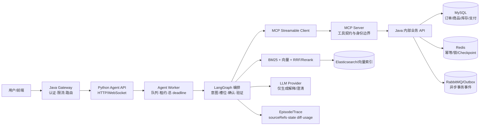

# AI_Shop 项目收口交付

> 版本边界：最新真实 HTTP 候选为 `customer-service-http-v20-20260825`，源码指纹 `736cad916dd2cd1387e7a2dbfee5eca7f8107c78a749b469348e9490be2bea26`；订单事实 contract 另见 [order-facts-contract-v1-20260825-r4](closure-evidence/order-facts-contract-v1-20260825-r4/report.md)。
> 本文把当前源码 contract、历史只读评测和 v20 人工答案证据分开记录；不把离线结果写成生产指标。

## 一句话结论

AI_Shop 已形成“Java 权威业务状态 + Python Agent 编排/检索 + MCP 工具边界 + 可审计证据与验证器”的闭环。当前收口重点已经落到动态订单事实、操作资格和引用证据链：订单字段必须有字段级 claim，取消/确认/评价等能力必须有 Java 决定，售后资格必须绑定版本化策略元数据，错订单项不能降级成普通订单卡。

### 2026-08-25 v20 HTTP 与人工答案收口

在 v14 补齐 `java-gateway`、`agent-readiness`、`product-catalog` 和 `agent-write-fixture-boundary` 四项 regression preflight 依赖后，又针对订单事实、售后资格、搜索约束、退款政策路由和 canonical fact hint 做了定向修复，最终在同一源码指纹下生成 `customer-service-http-v20-20260825`。v20 真实 HTTP 请求完成 `60/60`、行为契约 `11/11`、handoff accuracy `1.0`、hard constraint violation `0`、fixture cleanup failure `0`；冻结运行包见 [v20 HTTP report](../../AI_Shop-backend/AI_Shop-agent/evaluation-evidence/benchmarks/customer-service/customer-service-http-v20-20260825/report.md)。

v20 本地 full-stack P50/P95/P99 为 `1011.116/2010.016/7268.746 ms`，边界明确为 `LOCAL_FULL_STACK_NOT_PRODUCTION_SLO`；Provider cost 为 `UNPRICED`，不能写成零成本。运行时 verifier PASS、引用结构有效和行为契约通过只说明执行与安全边界，不是人工答案质量。

两名真实 reviewer 已独立填写并封存 60 条 A/B 表，案件级完全一致 `56/60=93.33%`；4 条分歧由独立第三人 `reviewer-c` 仲裁。最终只读包状态为 `HUMAN_REVIEWED_ADJUDICATED`：答案正确 `57/60=95.00%`、可计分引用支持 `25/36=69.44%`、转人工适当 `60/60=100%`、unsafe answer `1/60=1.67%`、联合质量 `49/60=81.67%`。完整指标、CI、标签和 11 条 badcase 见 [v20 最终人工证据](../../AI_Shop-backend/AI_Shop-agent/evaluation-evidence/benchmarks/customer-service/customer-service-http-v20-answer-review-adjudicated-20260825/final-report.md)，双评父证据见 [v20 pending 包](../../AI_Shop-backend/AI_Shop-agent/evaluation-evidence/benchmarks/customer-service/customer-service-http-v20-answer-review-pending-adjudication-20260825/)。源 HTTP report 中生成时的 `PENDING_HUMAN_REVIEW` 保持不可变，外部 final package 才表示人工生命周期完成；`releaseGateEligible=false` 仍然正确。

v20 另保留完全隔离的模型辅助诊断，状态为 `MODEL_ASSISTED_DIAGNOSTIC_NOT_HUMAN_REVIEW`；60 条中 4 条模型判断分歧，没有形成可证实的新高价值修复项。模型诊断未写入上述人工指标，也没有替代任何 A/B 或仲裁标签。

订单事实源码 contract 检查仍为 `9/9`；早期完整 Python 回归为 `1417 passed, 7 skipped`，订单模块 Maven 为 `104 tests, 0 failures`。v20 最后两项退款路由/事实提示修复另完成受影响回归 `321 passed`，并通过 Ruff、`compileall` 和 `git diff --check`。这些测试与 v20 的 HTTP/人工证据口径彼此独立，均不能宣称线上答案质量或吞吐提升。

## 主架构



### 边界与所有权

| 部件 | 负责什么 | 明确不负责什么 |
|---|---|---|
| Java Gateway/服务 | 用户身份、订单/商品/库存/支付/退款、事务写入、幂等、最终状态 | 不把 LLM 文本当作业务事实 |
| Python Agent API/Worker | 意图与槽位、路由、LangGraph 编排、确认卡、响应验证、Episode | 不直接写订单、库存或支付 |
| MCP Server | 受控工具入口、工具契约、委托身份校验、调用 Java | 不自行推断订单资格或库存存在性 |
| MySQL/Redis/RabbitMQ | 持久事实、锁/Checkpoint/幂等、Outbox 与异步通知 | 不承载未经授权的模型状态变更 |
| Elasticsearch/向量索引 | 商品与知识召回、RRF/rerank 的检索证据 | 不决定订单动态事实 |
| LLM Provider | 候选集内解释、比较、澄清和自然语言生成 | 不生成商品 ID、库存、报价、订单状态或可执行资格 |

## 两条主链路

### 订单/客服链路

1. 请求进入 Agent 后先做意图、槽位和订单号解析；需要动态事实时进入订单引用解析器。
2. MCP 工具携带委托身份调用 Java `/internal/order/agent/*`。Java 重新校验用户归属，并返回订单、订单项、物流、评价、退款状态或操作资格。
3. Python 将动态来源放在 `tool_source_refs/businessSources`，与政策 RAG 来源分离。订单引用使用 `order-fact/v2`，每个可回答字段生成 `DYNAMIC_FACT` claim。
4. 响应验证器按字段检查状态、金额、商品名、规格、支付方式、数量、订单/订单项归属；只有订单号本身不能授权其它事实。
5. 取消、确认收货、评价等写提案必须有 Java `actionCapability` 决定和用户确认 token；售后资格还必须有 `decisionId/policyId/policyVersion/evaluatedAt`。
6. 最终 Episode/trace 保存工具调用、sourceRefs、验证问题码、state diff、终态和 usage；Java 写服务再次执行事务与幂等校验。

关键实现：[OrderAgentInternalController.java](../../AI_Shop-backend/AI_Shop-order/app/src/main/java/com/aishop/controller/internal/OrderAgentInternalController.java)、[evidence_refs.py](../../AI_Shop-backend/AI_Shop-agent/app/services/evidence_refs.py)、[response_verifier.py](../../AI_Shop-backend/AI_Shop-agent/app/services/response_verifier.py)、[order_reference_flow.py](../../AI_Shop-backend/AI_Shop-agent/app/graph/order_reference_flow.py)。

### 商品搜索/导购链路

1. `product_search_query` 将品牌、型号、预算、类别、排除词、比较对象拆成结构化约束。
2. BM25 与向量召回后用 RRF/rerank 合并；候选集再经过类别、品牌、预算、否定条件和 Java offer/inventory snapshot 校验。
3. 只把已返回且通过硬约束的候选交给 LLM 做解释或比较；无结果只说明“当前查询范围未命中”，不声称平台全量无货。
4. 每次搜索记录 query plan、retrieval variants、recall/rejection counts、候选快照和 hard-constraint audit，便于从 trace 定位漏召回与误过滤。

关键实现：[product_search_query.py](../../AI_Shop-backend/AI_Shop-agent/app/services/product_search_query.py)、[product_search_pipeline.py](../../AI_Shop-backend/AI_Shop-agent/app/services/product_search_pipeline.py)、[mcp_tools_service.py](../../AI_Shop-backend/AI_Shop-agent/app/services/mcp_tools_service.py)。

## 三条真实 badcase 收口

### 1. 动态商品名没有证据

**现象。** 客服回答能说出订单状态和商品名，但冻结的 `sourceRefs` 只有订单号/状态/金额，没有 `order_item.productName`。v13 人审将 `004/005/006/008/014/016/017/035` 归为引用不支持；其中有些答案逻辑上正确，问题仍是事实无法由可见来源核对。

**Trace 定位。** 在 HTTP Episode 的 `RAG_RETRIEVAL`/业务工具观察和最终 envelope 查看 `businessSources`：旧记录能看到订单 snapshot，却找不到对应 `order_item` 的 `productName` claim。代码侧对应 `tool_source_refs -> order_reference_evidence -> response_verifier` 传播链；复核素材在 [v13 仲裁 badcases](../../AI_Shop-backend/AI_Shop-agent/evaluation-evidence/benchmarks/customer-service/customer-service-http-v13-answer-review-adjudicated-20260824/badcases.jsonl)。

**根因。** Java 订单投影和 Python 引用投影只保留了订单级摘要；验证器曾把“有订单号”误当成足够的动态事实依据，模型生成的商品名因此可以混入答案。

**已实施修复。** Java 返回订单项的商品名、封面、规格、金额、数量和状态；`evidence_refs.order_refs()` 生成 `order-fact/v2` 字段级 claims，并带 `authorityBoundary`。验证器现在要求商品名与同一订单项 claim 精确匹配，错订单项选择直接返回空卡片；缺 claim 时返回 `DYNAMIC_FACT_WITHOUT_CLAIM` 和安全降级文案。

**当前回归证据。** 收口 contract 的 `order-product-claim`、`order-product-mismatch`、`selection-item-ownership` 均通过；完整报告为 `9/9`。新增回归位于 [test_response_verifier.py](../../AI_Shop-backend/AI_Shop-agent/tests/test_response_verifier.py)。

**当前人工证据。** v20 已完成新 observation、新双盲和新仲裁，可独立报告本次冻结输出的引用支持 `25/36=69.44%`；这不是与 v13 的严格因果 A/B。`008/009/014/018/019/020/021/027/029/043/055` 仍被判为引用不支持，不能因结构上存在 `sourceRefs` 而从分母删除。

### 2. 待发货状态被误判为不可取消

**现象。** `cs-gold-v1-012` 的订单处于“已付款、待发货”，回答却直接说“当前不能取消”，没有重新核验资格或转人工。第三人仲裁判定答案正确性和转人工均失败，且引用不支持。

**Trace 定位。** 查看该 case 的订单 snapshot、`actionCapability` 是否被调用、`response_verifier` 的 capability issue 和最终 `handoff` 事件。历史坏例的关键缺口是只有 `order.orderStatus`，没有 Java 返回的 `CANCEL_ORDER` decision；素材见 [v13 final-report.json](../../AI_Shop-backend/AI_Shop-agent/evaluation-evidence/benchmarks/customer-service/customer-service-http-v13-answer-review-adjudicated-20260824/final-report.json) 的 `cs-gold-v1-012`。

**根因。** 把订单状态快照当成操作资格。状态到能力不是一一同构关系，且资格可能在用户确认到实际写入之间变化；没有独立的服务端 decision，模型容易过度确定地拒绝或允许操作。

**已实施修复。** Java 新增只读 `/internal/order/agent/actionCapability`，返回 `decision/action/orderId/orderItemId/reasonCode/capabilityVersion/evaluatedAt`；`action_capability_ref` 只接受 Java 业务来源。验证器同时校验动作、订单/订单项和允许/拒绝极性；缺少决定、极性不匹配或目标不匹配均阻断答案。真实写命令仍在 Java 事务/锁内二次校验。

**当前回归证据。** 收口 contract 的 `capability-allowed`、`capability-polarity-mismatch` 通过；`test_response_verifier.py` 覆盖无决定、RAG 伪造决定、动作/订单项错配。Java `OrderAgentInternalControllerTest` 也随订单模块完整测试通过（模块总计 `104` tests、`0` failures）。

**剩余限制。** 当前 contract 是离线服务独立检查，不覆盖真实数据库竞态、写入失败或人工队列延迟；生产路径仍必须在执行命令时重新核验资格并保留 `INCONCLUSIVE/MANUAL_REVIEW`。

### 3. 预算/比较对象 hard-negative 仍漏召回

**现象。** 固定 v9 qrel 的三条难例仍未恢复：

| Case | 查询 | 未召回 | 成对回放结果 |
|---|---|---|---|
| `search-fin-v9-23-snack-100` | `100元以内旺旺雪饼和可乐零食` | `303019597302892`、`438316828084252` | Recall/MRR/NDCG delta `0` |
| `search-fin-v9-34-snack-no-wangwang` | `平价零食不要旺旺雪饼` | `303019597302892` | Recall/MRR/NDCG delta `0` |
| `search-fin-v9-47-compare-xm` | `WH-1000XM6和十周年版降噪耳机如何比较` | `350000232815799` | Recall/MRR/NDCG delta `0` |

**Trace 定位。** 在 [search-hard-negative paired cases](../../AI_Shop-backend/AI_Shop-agent/evaluation-evidence/benchmarks/search/search-hard-negative-paired-v1-20260823/cases.jsonl) 的 `candidateTrace[0]` 查看 `queryPlan.retrievalVariants`、`recallCounts`、`rejectionCounts`、`resultCount` 和 `stageLatencyMs`；坏例的 `badcases.jsonl` 明确标记 `RECALL_MISS_REMAINS`，而不是硬约束违规。

**根因。** 多对象 conjunction、否定条件和比较对象在查询解析/召回阶段被压缩，候选集合在 rerank 之前就不完整；后置硬约束可以过滤错误候选，却无法找回尚未召回的商品。

**已实施的边界修复。** 当前搜索链路继续保留显式否定、类别/品牌约束和候选审计，确保不以“修召回”为代价引入硬约束违规；这三条 hard-negative 没有被改 qrel 或从分母删除。

**剩余工作。** 这项尚未完成优化。下一步应在同一 qrel 上做 query decomposition、比较对象保留和候选集合 union 的 paired A/B，再用新的预注册 holdout 验证；当前只能报告“无回归”，不能报告质量提升。

## 当前指标与可用性

### 本轮可归因的源码证据

| 证据 | 结果 | 口径 |
|---|---:|---|
| 订单事实/资格/响应 verifier contract | `9/9` | 当前源码的固定离线 case；不是线上答案正确率 |
| Python 全量 pytest（`shop`） | `1417 passed, 7 skipped` | 7 项均因没有真实 MySQL 8 条件跳过 |
| Python Ruff / compileall / `git diff --check` | 全部通过 | Ruff 针对 `app evaluation tests scripts/project_closure_check.py` |
| Java `mvn -pl AI_Shop-order/app -am test` | `104 tests, 0 failures` | 订单模块及其依赖 reactor；RabbitMQ 外部集成条件跳过不计入通过数 |
| evaluation registry validate | `valid=true` | 历史数据锁、release 和 SHA-256 元数据完整 |
| regression preflight（v14） | `PASS` | 四项依赖均 ready；fixture scope 为 `LOCAL_EVALUATION_ONLY`，详见 [preflight-regression-20260825-r2](closure-evidence/preflight-regression-20260825-r2.json) |

### 历史只读质量观察（不能归因于本轮）

| 域 | 最新可复核观察 | 可怎么说 | 不能怎么说 |
|---|---|---|---|
| Search v9 | Recall@10 macro `0.962121`（44 query），micro `52/56`；MRR `0.937500`；NDCG `0.920521`；硬约束违规 `0` | 小商品集离线检索质量与约束门禁 | 线上 CTR/CVR、个性化收益、生产 SLO |
| RAG v9 | answerable Recall@5 `29/29`，lexical grounded/citation `50/50` | 封闭知识库的可审计下界 | 人工语义准确率、开放域泛化 |
| Agent v9 | 25 case/200 trials，`pass^8=1.0`，重复副作用 `0` | 冻结任务集的终态、幂等和安全契约 | 开放世界成功率 |
| 客服 HTTP v13 | 答案 `59/60`，引用支持 `20/34`，转人工 `59/60`，unsafe `0/60`，联合 `46/60` | 有人工兜底的受控客服回放 | 无人值守 grounded 客服、CSAT/FCR |
| 客服 HTTP v14 live observation | HTTP `60/60`；intent Macro-F1 `1.000000`；高风险召回 `1.000000`；答案人工质量指标待审 | 新 source fingerprint 下的本地 full-stack 执行与机器诊断 | 答案正确率、引用支持、线上 SLO；两个行为契约 badcase 仍保留 |
| 客服 HTTP v20 + 人工仲裁 | HTTP `60/60`；答案 `57/60`；引用 `25/36`；转人工 `60/60`；unsafe `1/60`；联合 `49/60` | 最新冻结输出的双盲+第三人仲裁质量证据 | 严格因果提升、无人值守客服、CSAT/FCR、生产 SLO |
| 本地容量 v5 | c8 `1.353 QPS`，混合 P95 `10.574s`，LLM 路径 P95 `12.013s` | 本机短时诊断和长尾定位 | 生产持续吞吐或 SLO |
| DB batch/N+1 | 100 候选 batch offer/decision P50 `23.864/2.405ms`；N+1 `89.805/70.501ms` | 受控数据库批量化证据 | 线上容量保证 |

历史结果和坏例的完整口径见 [AI质量评测与Badcase](../evaluation/AI质量评测与Badcase.md)；v13、v14 和 v20 均保留为各自只读 evidence，旧标签没有迁移到新输出。

## 验证与复现

```bash
cd AI_Shop-backend/AI_Shop-agent
conda run -n shop python -m pytest -q
conda run -n shop python -m ruff check app evaluation tests scripts/project_closure_check.py
conda run -n shop python -m compileall -q app evaluation scripts
conda run -n shop python -m evaluation.cli validate
conda run -n shop python -m evaluation.cli preflight --split regression

cd ..
mvn -pl AI_Shop-order/app -am test
```

当前源码 contract 证据：[report.md](closure-evidence/order-facts-contract-v1-20260825-r4/report.md)、[report.json](closure-evidence/order-facts-contract-v1-20260825-r4/report.json)、[evidence-manifest.json](closure-evidence/order-facts-contract-v1-20260825-r4/evidence-manifest.json)、[SHA256SUMS](closure-evidence/order-facts-contract-v1-20260825-r4/SHA256SUMS)。v14 live observation 和 preflight 仍作为历史阶段保留；当前 HTTP 运行以 [v20 report](../../AI_Shop-backend/AI_Shop-agent/evaluation-evidence/benchmarks/customer-service/customer-service-http-v20-20260825/report.md) 为准，答案质量以 [v20 adjudicated report](../../AI_Shop-backend/AI_Shop-agent/evaluation-evidence/benchmarks/customer-service/customer-service-http-v20-answer-review-adjudicated-20260825/final-report.md) 为准。旧的 [preflight-regression-20260825.md](closure-evidence/preflight-regression-20260825.md) 仍是历史 fail-closed 快照。

## 仍然存在的限制

- 没有真实线上用户、曝光、点击、购买、CSAT/FCR 或生产流量；不新增 CTR/CVR/GMV、线上客服成功率或生产容量结论。
- 旧 `evaluation-evidence` 数字是 immutable archive；v20 虽已完成真实回放和人工仲裁，仍不能把与 v13 的不同输出、不同 eligible 引用分母写成严格因果提升。
- v20 仍有 3 条答案错误、11 条引用不支持和 1 条 unsafe。`cs-gold-v1-014` 的“确认后将无法发起退款”是最高风险缺陷；`018/043` 是其余答案错误，全部 badcase 必须随证据包保留。
- Search 三条 hard-negative 尚未修复；当前仅证明没有引入硬约束回归。
- 本地延迟受共享机器、Provider 波动和 warm-up 影响；usage 缺失或未定价时费用保持 `null`，不能写成零成本。
- Java action capability 是写入前的只读预检，不是锁或事务保留；执行阶段仍需重新鉴权、校验状态并处理未知结果。
- 工作树仍有用户已有未提交修改和删除项；本轮没有 reset/checkout，也没有修改 `evaluation-evidence/**` 历史证据。

## 最高优先级收口顺序

1. **已完成：** 四项 preflight、v20 真实 HTTP replay、不可变运行包、双人盲审、4 条第三人仲裁和最终人工证据包；v13/v14 历史包保持只读。
2. 若继续改代码，先修 `cs-gold-v1-014` 的错误退款后果提示，再处理 `018/043` 的答案缺陷和其余逐 claim 引用缺口；任何修改都会产生新候选，必须新 run、新盲审，不能覆盖 v20 标签。
3. 在固定 qrel 上实现 Search query decomposition/对象保留 paired A/B，并增加新的 holdout；只有同分母、无硬约束回归才记录提升。
4. 项目不真实上线时，容量压测不再是当前收口阻塞；本地 P50/P95/P99 继续只作为诊断数据。
