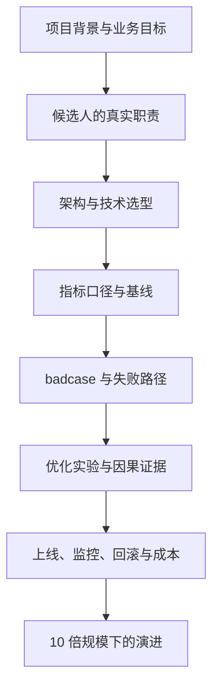
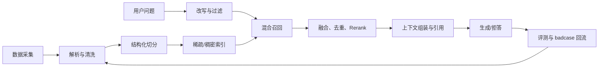

# 国内互联网 AI 应用 / Agent / AI 全栈 / Java 后端真实面经报告

> 2026 秋招（面向 2027 届）优化版，更新于 2026-08-13
> 适用岗位：AI 应用开发、AI Agent/智能体开发、大模型应用开发、AI 全栈、AI 后端/平台、Java/传统后端、交易与电商后端、部分大模型应用算法岗
> 用途：用两周左右建立正确准备优先级，快速补知识盲区，并能承受真实项目追问和场景设计题。

## 0. 阅读说明

这不是把帖子里的问题机械拼接成题库，而是把近期真实面经中的重复关注点归并成一套备考结构。正文优先保留：

- 第一人称面试过程，有公司、岗位、轮次、时长、结果或现场反应；
- 项目追问中的连续因果链，而非只有孤立名词；
- 传统后端、计算机基础、LLM 基础、RAG/Agent、评测、安全、手撕和系统设计的完整覆盖；
- 能回查的原帖链接。

明确带有“面试辅助、可以 T、捞人上岸、完整推荐回答、课程/付费”等信号的内容不作为核心证据。问题列表写得过于工整但缺少现场细节的帖子，只作为 B 级佐证，不单独支撑高频结论。

本版把证据分为三层，避免把不同岗位、不同时间窗口硬合并成一个失真的百分比：

| 证据层 | 用途 | 统计口径 |
|---|---|---|
| 原 196 份 AI 核心样本 | 判断 AI 应用/Agent 面试主题的相对频率 | 保留原分母；正文中的百分比均来自这一层 |
| 2026-08-09 之后的 AI 增量 | 判断秋招最新追问是否发生变化 | 逐帖人工判断，不因样本少而计算新百分比 |
| 后端与 AI 全栈扩展样本 + 官方 JD | 判断 Java、交易/电商、全栈岗位的能力边界 | 只做定性归纳，不混入 196 份 AI 样本 |

因此，文中的 58.2% 仍只表示 196 份中有 114 份正文命中 RAG 相关表达，不代表任意一场面试有 58.2% 概率提问，也不代表问题数量占比。

### 0.1 这次更新真正新增了什么

从 2026-08-09 到 2026-08-13，人工复核后没有发现足够证据把新帖子并入原 196 份 AI 核心分母；但出现了 1 篇新的高价值 Agent 一手面经，以及 2 篇值得纳入后端/全栈增量层的帖子。新增样本仍然很少，不应伪造“趋势暴涨”。

**最新高价值增量**：

- [小红书 Agent 开发一面，2026-08-12 发布][A15]：作者标明京东后端实习背景，正文写出“晚饭后秒约二面”，并完整记录了 Agent 并发、长短期记忆、ReAct、Planner/Executor/Critic、上下文拆分、Redis/Java 类加载，以及“广告投放自我迭代”的场景题。页面正文和发布时间已用浏览器复核；这是一篇 A 级一手来源，但只能说明这些问题真实出现过，不能单独支撑高频。
- [字节抖音电商后端一面，2026-08-12 发布][C07]：同一轮把 MCP/Skill、Go context/逃逸、MySQL 索引与事务、SQL 去重和 LC209 放在一起，进一步证明 AI 全栈/AI 后端与传统后端基础是混合考察，而不是二选一。
- [百度秋招后端开发二面，2026-08-13 发布][C08]：正文集中问 GMP、channel/map、GC、协程/内存泄漏、MySQL/MVCC/InnoDB、Kafka 零拷贝/顺序/重复与 Redis 跳表/分布式锁，并追问如何控制 Vibe Coding 的 bug。帖子现场感较强，但作者自述为 Go 背景，因此只作后端工程增量佐证，不外推为 Java 高频。

前一轮纳入的字节 AI 应用一面 [A14] 虽不是过去一天的新帖，但它强化的五条主线仍与本轮样本一致：

- Tool 的抽象边界、参数 schema、错误码与异常回传；
- Memory 的短期/长期划分、存储、过期和去重；
- ReAct 与 Plan-and-Execute 的适用场景，多 Agent 通信与共享状态；
- RAG 全链路、chunk/overlap 实验、混合检索、rerank、RAG 与微调的选择；
- 延迟、成本、badcase、幻觉、超时、稳定性、监控与可观测性。

框架层的新增判断也更清楚：LangGraph 的 State/Node/Edge/Checkpoint/恢复与循环终止属于多源重复的项目追问；FastAPI 的真实问法集中在 SSE、StreamingResponse、中间件/依赖注入、asyncio 并发和超时降级；Spring AI 主要是“为什么选它、与 LangChain4j/LangGraph 怎么取舍、ChatMemory/模型切换如何落地”，目前应按项目触发准备，不能写成通用必问。完整问题、答题骨架和来源分级见独立文档 [AI 应用开发 Java/Python/AI 框架真实面试题](./AI应用开发_Java_Python_AI框架真实面试题.md)。

更显著的增量来自 **后端与 AI 全栈的交叉面经**：近期百度后端会沿 Agent 项目继续追缓存位置、数据库压力、MQ 积压、并发正确性、工具失败恢复和 HTTP/RPC；小红书 Agentic 全栈会同时追写操作边界、编排、日调用量、扩容、Java 与 MySQL；小公司 AI 全栈则直接问 React、设计稿还原、鉴权和数据库选型。[C01][H01][H03]

这轮更新后的判断不是“考纲换了”，而是三件事更确定了：**项目指标必须可证、AI 系统必须按线上服务回答、全栈岗位必须能把产品从界面做到上线。**

## 1. 最重要的结论

1. **项目深挖和 Agent 架构是绝对主线。** 严格样本中分别达到 80.1% 和 86.7% 的文档命中；面试官最关心候选人是否真实做过、为何这样设计、指标是否可信、失败后如何处理。
2. **RAG 很重要，但不是全部。** RAG 命中 58.2%；数据库/缓存 49.0%，并发/OS/JVM 47.4%，传统手撕 41.3%。只背向量库和 LangChain 远远不够。
3. **岗位名称不等于统一考纲。** “AI 全栈”可能大量问 Web/JavaScript，“AI 后端”可能重点问 Kafka、HTTP/2、Redis，“应用算法”会提高 Transformer、微调和评测深度。
4. **面试正在同时考传统编码和 AI 辅助编码。** 传统现场编码命中 41.3%；AI Coding/Vibe Coding 相关信号为 29.1%。后者在增加，但没有取代算法题。
5. **项目数字一定会被反算。** 正确率、召回率、P95、耗时下降、QPS、成本下降等数字若没有口径、基线、样本量和 badcase 分布，很容易成为失分点。
6. **真正拉开差距的是生产闭环。** 评测、可观测性、超时/重试/幂等、权限、提示注入、成本和回滚比“会调用模型 API”更能证明应用开发能力。

### 1.1 频率总表

| 频率层级 | 主题 | 命中数 / 196 | 样本命中率 | 准备要求 |
|---|---|---:|---:|---|
| 极高 | Agent 架构、工作流、规划与执行 | 170 | 86.7% | 必须能画完整运行链路并解释边界 |
| 极高 | 项目/实习深挖 | 157 | 80.1% | 至少准备两条完整追问链 |
| 高 | RAG | 114 | 58.2% | 从解析、检索到评测和更新全链路 |
| 高 | 数据库与缓存 | 96 | 49.0% | MySQL、Redis、慢查询、一致性 |
| 高 | 并发、OS、JVM/Go 运行时 | 93 | 47.4% | 线程/协程、锁、线程池、GC |
| 高 | Tool Calling、MCP、Skill | 83 | 42.3% | 会辨析概念，更要会讲权限和失败处理 |
| 高 | 传统手撕代码 | 81 | 41.3% | 中等题、ACM 模式、复杂度与边界 |
| 中 | 评测、质量、badcase | 62 | 31.6% | 指标、数据集、回归和线上闭环 |
| 中 | 记忆与上下文 | 60 | 30.6% | 分层、压缩、冲突、长期信息取回 |
| 中 | AI 辅助编码 | 57 | 29.1% | 会控范围、看 diff、测试和解释代码 |
| 中 | 网络 | 54 | 27.6% | TCP/HTTP/HTTPS/SSE/WebSocket/HTTP2 |
| 中 | 场景题/系统设计 | 53 | 27.0% | 约束、最小架构、失败、安全、演进 |
| 中 | 分布式与消息队列 | 46 | 23.5% | Kafka、积压、顺序、幂等、重放 |
| 中 | 微调、训练与 RL | 44 | 22.4% | 知道何时需要，能解释基本方法 |
| 中 | LLM 基础 | 43 | 21.9% | Token、Attention、KV Cache、采样 |
| 较低但重要 | 安全、注入、隐私 | 35 | 17.9% | 高风险工具题的关键加分项 |
| 较低但重要 | 可靠性、超时、重试、降级 | 33 | 16.8% | 常隐藏在项目追问里，不能忽略 |
| 较低 | 推理优化 | 25 | 12.8% | 应用岗掌握原理与指标即可，Infra 岗加深 |

## 2. 岗位边界、官方 JD 与轮次倾向

### 2.1 同名岗位可能是四种工作

| 岗位形态 | 面试重点 | 应提高的准备权重 |
|---|---|---|
| AI 应用 / AI 全栈 | 端到端交付、Web、流式交互、RAG、AI Coding、产品感 | 项目、前后端基础、鉴权、数据流、上线指标 |
| Agent / 智能体开发 | 编排、工具、记忆、上下文、可靠性、评测 | Agent 运行时、状态机、工具治理、trace、安全 |
| AI 后端 / 平台 | 网关、并发、存储、MQ、模型供应商、观测与成本 | 后端八股、系统设计、限流、路由、容灾 |
| 大模型应用算法 | RAG/Agent 算法、评测、微调、数据与模型原理 | Transformer、Embedding、训练、离线实验 |

真实例子说明差异很大：字节 Agent 日常实习同时问 JVM、锁、分页分段和 HTTP/HTTPS [A01]；字节小荷健康 AI 全栈问权限、Cookie/Session、JavaScript Event Loop 和字符串算法 [A07]；深信服 AI 开发继续深挖 Kafka、HTTP/2、DMA 和云原生隔离 [A04]。

投递前应从 JD 提取四个信号：主要语言、是否拥有在线服务、是否自研/训练模型、是否强调 Agent 平台或产品交付。准备比例应跟着这些信号调整，而不是只看岗位标题。

### 2.2 2027 届官方 JD 显示的三条岗位路线

以下是 2026-08-12 对字节跳动、美团官方招聘页的截面核验。它们只能说明这些具体岗位的要求，不能据少数 JD 推导“全行业百分比”。

| 路线 | 官方 JD 直接信号 | 面试准备重点 |
|---|---|---|
| Java / 交易与电商后端 | TikTok Shop 资金后端强调亿级用户、大流量高并发、架构设计、性能调优、数据结构/算法/OS；美团搜索后端要求 Java、分布式/微服务、Redis/Kafka/Elasticsearch [J05][J07] | Java/JVM、Spring、MySQL、Redis、MQ、网络、并发、一致性、压测排障、算法题 |
| AI 全栈 | 美团要求独立完成需求、产品方案、前端 + 后端 + 上线，建设 Agent Loop，并跟踪激活/留存/调用量；字节 TikTok Shop AI 全栈要求页面、服务端、数据链路、上线验证、AI Coding 与线上排障 [J06][J08] | React/Vue、API、数据建模、鉴权、流式交互、部署监控、产品指标、AI Coding、Agent/RAG |
| AI 应用 / Agent / AI 后端 | 字节数据 Agent 岗同时要求调度、工具编排、数据网关、权限、可观测性、高可用、RAG 和全栈交付；创作 Agent 岗继续强调稳定性、评测、成本和模型基础 [J01][J02] | Agent 架构、工具/记忆/RAG、评测、安全、可靠性，以及扎实后端工程 |

另外两个容易忽略的细分方向：飞书 AI 后端把多源数据接入、大规模索引、搜索链路优化和高可用放在核心位置 [J04]；Agent 评测岗位直接招聘能够建设指标、Benchmark、自动化评测和缺陷分析闭环的工程候选人 [J03]。这说明“评测”和“搜索/数据工程”并非附属知识，而可能就是岗位主体。

### 2.3 一份 JD 的快速拆解法

用五列做投递前检查，十分钟即可得到个人考纲：

| 信号 | 看到什么词 | 应如何调整 |
|---|---|---|
| 交付边界 | 独立上线、全栈、产品原型、用户指标 | 增加前端、鉴权、部署、埋点和产品取舍 |
| 服务规模 | 高并发、高可用、亿级、性能优化 | 增加容量估算、缓存、MQ、降级、压测和事故复盘 |
| AI 深度 | Agent 编排、RAG、模型选型、微调、评测 | 增加架构选择、实验设计、badcase 和模型基础 |
| 数据形态 | 搜索、索引、数仓、多源接入、Text-to-SQL | 增加检索、权限、数据更新、查询安全和一致性 |
| 主语言/框架 | Java/Spring、Go、Python、React/TS | 按岗位主栈准备运行时、框架原理与现场编码，不用简历语言替代 JD 语言 |

### 2.4 后端与全栈扩展样本的定性优先级

这部分没有足够一致的样本分母，因此只按“多场交叉出现、官方 JD 强调、对录用区分度”给出优先级，不伪造命中率：

| 优先级 | Java/交易后端 | AI 全栈 | 三类岗位共同关注 |
|---|---|---|---|
| P0 | 项目真实性、Java/Spring、MySQL/Redis、并发与手撕 | 端到端项目、前后端闭环、鉴权、数据状态、上线 | 指标口径、个人贡献、技术取舍、失败路径 |
| P0 | 库存/订单状态、缓存一致性、MQ 幂等与积压 | Agent/RAG、流式交互、AI Coding、部署排障 | 测试可复现、监控、性能瓶颈、扩容 |
| P1 | JVM/OS/网络、慢 SQL、分布式与服务治理 | React/Vue、数据库选型、产品指标与用户体验 | 安全、权限、成本、回滚、场景设计 |
| P2 | 深入中间件/运行时源码，视 JD 与项目加深 | 复杂前端工程化，视岗位主方向加深 | 微调/推理优化，视岗位是否偏算法加深 |

PDD 服务端二面尤其说明“会报一个性能数字”不等于做过性能工程：面试官继续追数据来源、正确性、互操作测试、`perf`、GDB 和可复现方法，并明确反馈测试方法薄弱 [C03]。AI 项目中的准确率、延迟和成本同样要能复跑、对照和解释误差。

### 2.5 语言与框架优先级（本轮新增）

这张表不使用“框架关键词出现次数”冒充频率，而按人工核验后的**多源重复、明确追问和项目触发**排序。题目原文、回答骨架和全部链接见独立题集。

| 优先级 | 语言/框架 | 真实面试关注点 | 证据判断 |
|---|---|---|---|
| P0 | Java / JVM | 集合与 HashMap、并发/锁/CAS、JVM 内存与 GC、类加载、线程池、虚拟线程、MySQL/Redis/MQ 联动 | 多源重复；AI 后端和传统 Java 都会出现 |
| P0 | Spring Boot / Spring | IOC/AOP、Bean 生命周期、循环依赖、事务失效、MVC 请求链、自动配置与启动流程 | 多源重复；常随项目深挖 |
| P0 | Python / asyncio | GIL、进程/线程/协程、asyncio 并发、生成器/装饰器、异常与超时 | 多源重复；AI 应用岗常与 FastAPI 一起问 |
| P0 | LangGraph | State、Node/Edge、条件路由、Checkpoint、恢复、interrupt/HITL、循环终止、并发状态竞争 | 多源重复；属于项目触发的高区分度主题 |
| P1 | LangChain / LCEL | Runnable/链、Tool、Retriever、Memory、callback/trace、结构化输出；与 LangGraph 的边界 | 多源重复；不要只背模块名 |
| P1 | FastAPI | ASGI/Uvicorn、依赖注入、中间件、SSE/StreamingResponse、部署并发、超时降级 | 多源但题量低于 Java/Spring；项目触发 |
| P1 | Spring Cloud | 注册发现、配置热更新、网关、负载均衡、熔断/降级、链路追踪 | 近期明确帖子较少；按 JD/项目补，不宣称高频 |
| P2 | Spring AI | ChatClient/Advisor/ChatMemory、Tool Calling、RAG、模型路由、观测和版本兼容 | 多篇真实项目追问，但尚未形成通用八股高频 |

### 2.6 轮次常见倾向

| 轮次 | 常见目标 | 候选人应准备的证据 |
|---|---|---|
| 一面 | 基础是否扎实、项目是否真实、代码是否能写 | 90 秒项目介绍、核心链路、基础八股、1–2 道中等题 |
| 二面 | 取舍、深度、生产问题、场景设计 | 指标口径、badcase、事故/失败、可靠性、安全、扩展方案 |
| 三面/主管面 | 业务理解、所有权、学习与协作 | 为什么做、产生什么价值、如何推进分歧、未来优化 |

这只是倾向，不是固定流程。B站二面直接做两个 Agent 系统设计 [B01]，美团二面围绕记忆、上下文和 trace 连续追问 [B04]，也有字节一面几乎全是传统计算机基础 [A09]。

## 3. 项目深挖：整份报告最值得练的部分

### 3.1 面试官实际在验证什么



近期帖子中常见的真实性验证包括：

- “项目是在公司做的还是练手的”“主要负责哪一块”“哪些是 AI 写的，哪些是自己实现的” [A03][A04][A07]；
- “为什么选这个模型/框架”“是否试过替代方案”“不用多 Agent 会怎样” [A03][A10][A11]；
- “正确率为什么只有 60%”“召回率 75%，剩余 25% 是什么”“人工标了多少条” [A04][B05]；
- “耗时从 30 分钟到 5 分钟具体做了什么”“模型输出质量靠 benchmark 还是人工” [A10]；
- “工具失败、上下文爆炸、权限绕过、漏检高危命令时怎么办” [A04][A07][A08]。

### 3.2 90 秒项目介绍模板

> 项目服务于【用户/业务场景】，原来的核心问题是【可量化痛点】。第一版基线是【规则/人工/普通检索/固定流程】，主要瓶颈在【准确率、时延、成本或覆盖】。系统链路是【输入 → 解析/路由 → RAG/Agent/工具 → 校验 → 输出】。我负责【明确模块和关键决策】，做过【两项具体优化】。指标从【有口径的基线】变为【结果】，评测集规模和分布是【说明】。最典型 badcase 是【例子】，当前仍有【限制】，若流量或数据扩大 10 倍，我会先改【瓶颈】。

这段话必须能展开为 15–20 分钟，而不是背完就结束。

### 3.3 高频追问与回答落点

| 高频追问 | 合格回答必须包含 |
|---|---|
| 为什么做这个项目？ | 用户、流程、原方案成本/错误、为何值得用 AI；不要只说“学习 Agent” |
| 为什么选这个架构/框架？ | 需求约束、候选方案、取舍、验证结果；框架名不是理由 |
| 哪部分由候选人完成？ | 代码/设计/实验/上线边界，AI 辅助比例，能够打开代码或 trace 证明 |
| 指标如何得到？ | 指标定义、样本量、切分方式、基线、置信度/波动、失败样本 |
| 最大难点是什么？ | 具体症状、定位过程、根因、尝试过的失败方案、最终改动和结果 |
| badcase 怎么处理？ | 分类、占比、优先级、修复层、回归集和线上验证 |
| 系统异常怎么办？ | timeout、有限重试、幂等、熔断、降级、checkpoint、人工处理 |
| 如何控制成本？ | token/调用次数/并发/缓存/模型路由，及质量损失 |
| 如何上线和回滚？ | 版本、灰度、观测、阈值、一键回滚、数据兼容 |
| 规模扩大 10 倍？ | 先算瓶颈和容量，再谈缓存、异步、分片、限流和扩容 |

### 3.4 数字被反算时怎么答

任何指标至少准备以下六件事：

1. 定义：分子、分母、时间窗口、去重口径。
2. 数据：来源、规模、业务切片、是否有泄漏。
3. 基线：与规则、旧版本、通用模型还是人工对比。
4. 变化：改了哪个变量，是否做消融或对照。
5. 分布：平均值之外的 P95/P99、长尾和失败类型。
6. 可信度：重复实验、人工复核、线上/离线差异。

如果数字只是 Demo 上的粗测，应直接说明“这是小样本开发集结果，不等同线上指标”，再补计划如何建立正式评测，远好于编造精确结论。

## 4. RAG：必须能讲完整链路



### 4.1 高频问题

- 文档怎么解析，表格、图片、跨页内容如何保语义？
- chunk 太大或太小分别有什么问题，为什么选当前参数？
- 为什么引入 BM25、父子索引、query rewrite、rerank？ [A06][B07]
- top K 取多少，如何平衡召回、上下文噪声、延迟和 token？
- 文档频繁更新，如何避免原文、向量索引和缓存不一致？ [B07]
- 如何区分“没召回”与“模型没用好证据”？
- RAG 如何评测，如何提升相关度和回答效果？ [A06]
- 何时用固定 RAG，何时升级 Agentic RAG？ [A05]

### 4.2 简要答题框架

| 问题 | 答题思路 |
|---|---|
| chunk 如何选 | 先按标题、段落、表格等结构切分，再用长度上限；对父子块/滑动重叠做对照；以 Recall@K、答案正确率、token 和延迟共同选型，不背固定数字 |
| 为什么混合检索 | BM25 擅长专名、编号和精确词，向量擅长语义改写；用 RRF 或经验证的权重融合，再 rerank |
| 父子索引 | 小块用于精确召回，命中后回取较大的父块补上下文；防止大块召回不准、小块语义不完整 |
| top K 怎么定 | 看召回曲线和 rerank 后增益；设置上下文 token 预算，按分数、来源多样性、重复度动态截断 |
| 热更新 | 保存 `doc_id/version/chunk_id`；新版本增量建索引并校验，切换别名；删除用 tombstone；缓存按版本失效 |
| 如何评测 | 检索：Recall@K、MRR/nDCG；生成：忠实度、答案相关性、引用正确率；端到端：任务成功率、拒答和业务指标 |
| 如何定位问题 | 先检查 gold 证据是否被召回，再看 rerank/上下文是否保留，最后看模型是否正确引用；三个阶段分别归因 |

RAG 不是“把文档放进向量库”。真正被问的是解析、检索、权限、更新、评测和线上稳定性。

## 5. Agent、工具、记忆与可靠性

### 5.1 Workflow 与 Agent 的分界

| 方式 | 适合 | 优点 | 风险 |
|---|---|---|---|
| 普通代码/规则 | 逻辑确定、可枚举、强一致 | 快、便宜、可测试 | 覆盖开放输入能力弱 |
| Workflow/状态图 | 步骤大体已知，有少量条件分支 | 可控、可观测、易恢复 | 对未知任务适应性有限 |
| 单 Agent | 需要动态选择工具和下一步 | 灵活，复杂度相对可控 | 可能循环、漂移、成本不稳定 |
| 多 Agent | 子任务边界清楚、可并行或需独立审查 | 专业分工、可隔离上下文 | 通信、冲突、延迟、调试成本高 |

“复杂任务”不自动等于“多 Agent”。先证明单 Agent/Workflow 的瓶颈，再引入多 Agent。字节 AI 全栈候选人因多 Agent 协商开销大而选择工作流，这就是合理取舍 [A03]。

### 5.2 ReAct、Plan-and-Execute 与图编排

- **ReAct**：观察、思考、行动循环，适合步骤不确定且每步依赖新观察的任务；要限制最大步数、工具预算和终止条件。
- **Plan-and-Execute**：先拆计划再执行，适合长任务和可并行子任务；要处理计划过期、重规划成本和执行结果回填。
- **状态图/Workflow**：显式节点、边和状态，适合生产流程、审批、恢复和可观测；动态性可以局部放在某个节点，而非整个系统自由运行。

### 5.3 Function Calling、MCP、Skill 不要混答

| 概念 | 更准确的定位 | 面试落点 |
|---|---|---|
| Function/Tool Calling | 模型或模型 API 以结构化参数选择工具的能力/接口 | schema、参数校验、执行者、错误回传、权限 |
| MCP | Host、Client、Server 之间暴露工具/资源/提示等能力的开放协议 | 发现、连接、传输、生命周期、授权和隔离 |
| Skill | 某个宿主或产品定义的可复用说明、工作流和资源包 | 依赖宿主实现，不是全行业统一标准 |

现代 MCP 规范的标准传输应关注 `stdio` 和 **Streamable HTTP**；旧文章常写的 HTTP+SSE 属于早期/兼容形态。协议细节以 [MCP 官方规范](https://modelcontextprotocol.io/specification/2025-06-18) 为准。

不能声称所有 MCP 工具 schema 永远完整驻留上下文；具体宿主可能做工具检索、动态加载或摘要。回答时应区分协议定义和宿主实现。

### 5.4 记忆、上下文与 RAG 的关系

- **当前任务状态**：目标、计划、已完成步骤、工具调用和待确认事项，通常结构化保存。
- **短期对话**：近期轮次和必要原文，直接参与当前推理。
- **摘要记忆**：较早会话的压缩表示，需评测事实保留和任务连续性。
- **长期记忆**：用户偏好、历史任务或经允许保留的事实，有来源、时间、置信度、过期与更正机制。
- **RAG 知识**：来自外部文档、数据库或知识库，按当前问题检索。

记忆与 RAG 的区别是 **信息角色和生命周期**，不是简单的“动态数据与静态数据”。两者都可能动态更新，也都可能使用检索。

### 5.5 可靠性回答清单

一次工具/Agent 调用至少考虑：

- deadline、最大步数、最大 token、最大费用；
- 瞬时错误的有限重试、指数退避与抖动；
- 副作用操作的幂等键、调用账本和状态查询；
- 熔断、舱壁、限流、排队和降级；
- checkpoint、断点续跑、取消、补偿和死信；
- 高风险动作预览、权限校验和人工审批；
- trace、模型/Prompt/工具版本、指标与审计。

相关真实追问见深信服的异常/沙箱链 [A04]、字节的 API 超时和线程池场景 [A08]、京东的长工具上下文和突发流量 [B02]。

## 6. 评测、幻觉、安全与 badcase

### 6.1 评测要分层

| 层级 | 常用指标 | 关键问题 |
|---|---|---|
| 检索 | Recall@K、MRR/nDCG、权限过滤正确率 | 证据是否被找到、排序是否合理 |
| 生成 | 忠实度、答案相关性、引用正确率、拒答正确率 | 是否基于证据回答、是否编造 |
| 工具 | 工具选择、参数正确率、执行成功率、重复调用率 | 是否选对并安全执行 |
| Agent 链路 | 任务成功率、步骤数、恢复率、人工接管率 | 是否完成任务、失败能否恢复 |
| 系统 | P50/P95/P99、可用性、token、费用、队列时长 | 是否可上线和可持续 |
| 业务 | 一次解决率、转化、处理时长、用户满意度 | 技术改进是否产生真实价值 |

评测集应覆盖正常、边界、长尾、拒答、权限、长上下文、工具失败、提示注入和历史 badcase。LLM-as-a-Judge 可用于扩展，但需校准、抽样人工复核，不能把 Judge 分数当绝对真值。

### 6.2 幻觉应先归因

| 根因 | 优先处理 |
|---|---|
| 知识缺失/过期 | RAG、数据更新、来源引用、无答案检测 |
| 检索失败 | query rewrite、混合召回、rerank、索引/权限排查 |
| 上下文噪声/冲突 | 去重、分段、结构化组装、冲突消解 |
| 模型未遵循证据 | 约束输出、引用校验、较合适模型、必要时微调 |
| 工具结果错误 | 参数校验、结果校验、重试/降级、数据源治理 |
| 任务本身不确定 | 主动澄清、置信度、拒答或人工接管 |

“加 RAG”不是所有幻觉的通用答案；如果检索正确但模型错误引用，应从上下文、Prompt、模型或校验层修复。

### 6.3 提示注入与工具安全

- 把用户输入、检索文档和网页内容视为不可信数据，不允许其覆盖系统策略。
- 工具在服务端做身份、租户、权限、参数和业务规则校验；模型不是授权系统。
- 对工具做 allowlist、最小权限、网络出口限制、敏感凭证隔离和审计。
- 转账、删除、发信、提交 PR 等动作需要预览和人工确认。
- 输出到 HTML、SQL、Shell、日志等下游前做相应编码/解析，不用字符串拼接代替结构化 API。
- 建立注入、越权、数据外泄和间接注入测试集，随版本回归。

## 7. 后端工程与计算机基础

### 7.1 为什么不能只准备 AI

近期真实面经中，字节一面问 JVM 分代、锁、分页分段和 HTTPS [A01]；百度二面问线程/协程、Go GMP 和可见性 [A02]；深信服从 Kafka 追到零拷贝、DMA、HTTP/2 阻塞 [A04]；字节财经一面连续问 OS、网络、哈希、MySQL、Redis 和限流 [A09]。

新增的交叉样本把这一点说得更直接：

- 百度后端一面从 Agent/Skill 项目的业务指标与容量瓶颈，一路追到缓存位置与过期、数据库压力、Prompt 热修复、MQ 积压、缓存击穿与一致性、并发正确性、MCP/Memory 和工具恢复，最后仍有滑动窗口手撕 [C01]。
- 百度另一场后端一面要求手写带版本号的乐观锁库存扣减，并追问 CAS 失败率很高怎么办；这类题同时考 Java 并发、数据库条件更新和业务正确性 [C02]。
- 滴滴 AI Agent 后端同时问 Memory/幻觉/上下文污染、Spring AOP/MVC/循环依赖、Redis 哨兵与大 key、MQ/MVCC/索引，以及电商搜索框、WebSocket、扫码登录、服务发现和 GC [H04]。
- 携程 Java 后端二面反过来深入追问 RAG 的真实性、分块、向量库、query rewrite 和技术取舍，再回到 MySQL、redo log 和延迟双删 [C06]。

结论是：传统后端和 AI 应用不是两套互斥考纲。越接近真实业务，越容易围绕同一项目同时问 **模型不确定性** 与 **服务确定性**。

### 7.2 最小必备清单

| 模块 | 至少掌握 |
|---|---|
| MySQL | B+ 树、聚簇/二级索引、联合索引、回表、索引失效、事务隔离、MVCC、redo/undo/binlog、慢查询 |
| Redis | 常用结构、线程模型、过期/淘汰、持久化、分布式锁、缓存穿透/击穿/雪崩、数据库一致性、热点/大 key |
| 并发 | 进程/线程/协程、可见性、CAS/锁、线程池、生产消费、死锁、Go GMP 或 Java 并发模型 |
| JVM/运行时 | 内存区域、对象生命周期、GC、类加载、GIL/生成器等与所用语言匹配的基础 |
| 网络 | TCP 可靠性、握手挥手、HTTP/HTTPS、HTTP/1.1 与 HTTP/2、SSE/WebSocket、DNS/TLS、URL 访问链路 |
| MQ/分布式 | Kafka 分区、副本、消费组、rebalance、积压、顺序、幂等、重放、一致性与分布式锁 |
| Web/安全 | Cookie/Session/JWT、鉴权授权、越权、CSRF/CORS、流式返回、网关、API 设计和日志脱敏 |
| Spring/Java 工程 | IOC/AOP、Bean 生命周期、循环依赖、事务传播/失效、MVC 请求链、线程池、虚拟线程、构建与依赖管理 |
| 测试与排障 | 单元/集成/端到端测试、压测口径、可复现性、日志/trace、JFR/async-profiler 或 `perf`、线上止损和回滚 |

### 7.3 三个高频回答骨架

**慢 SQL**：先看慢日志和调用频率 → `EXPLAIN/EXPLAIN ANALYZE` → 扫描行、索引、回表、排序/临时表、锁等待 → 结合数据分布改索引/SQL/分页/预聚合 → 压测并观察写放大与回归。

**Redis 与数据库一致性**：先说明一致性要求；常规场景用 Cache Aside，写库成功后删缓存；删除失败用 Outbox/事务消息、重试或 CDC；缓存带版本防旧值覆盖；资金/库存以数据库或专用一致性机制为事实源。

**HTTP/2 仍可能阻塞吗**：HTTP/2 在一个连接内用多路复用缓解 HTTP/1.1 应用层队头阻塞，但底层仍基于 TCP；丢包会阻塞该 TCP 连接后续字节交付。不要回答成“HTTP/2 完全没有队头阻塞”。

### 7.4 Java 电商后端底座如何迁移到三类岗位

不要把项目包装成不存在的“AI 电商平台”。先以真实功能为边界，再把同一种工程能力翻译成目标岗位关心的语言：

| 若项目中真实实现了 | Java/电商后端表达 | AI 全栈表达 | AI 应用/Agent 表达 |
|---|---|---|---|
| 订单/库存状态与并发扣减 | 状态机、条件更新、乐观锁、不超卖、对账 | 前端状态反馈、重复提交、最终状态查询 | 副作用 Tool 的幂等键、状态查询、重试前判定与补偿 |
| 支付回调或异步业务 | 回调验签、幂等、消息可靠性、异常订单 | 用户进度、失败可见、通知与恢复 | 长任务 checkpoint、工具调用账本、人工确认与恢复 |
| Redis 缓存 | Cache Aside、热点、击穿/穿透/雪崩、一致性 | 页面响应、会话/配额、缓存失效体验 | 确定性结果缓存、Memory 过期/去重、模型网关限流 |
| MQ 与定时任务 | 重试、重复消费、积压、死信、补偿、对账 | 异步任务进度与通知 | Agent 节点事件驱动、断点续跑、失败隔离 |
| 搜索/商品数据 | 索引设计、分页、缓存、搜索性能 | 搜索交互、过滤、数据模型 | 混合检索、rerank、商品知识 RAG、权限与新鲜度 |
| 鉴权与用户体系 | 登录态、RBAC、接口越权、租户/数据权限 | 前后端鉴权、路由保护、错误态 | 工具最小权限、用户确认、审计、检索权限过滤 |
| 监控、压测或灰度 | QPS、P95/P99、错误率、容量、回滚 | 埋点、激活/留存、发布验证 | 任务成功率、工具成功率、token/成本、Prompt/模型版本 |

只有真正实现、测试或验证过的行才写进简历。没有做过库存、支付、MQ、压测或多租户，就不要因本表出现而声称做过；可以把它们作为“面试官继续扩展时的设计答案”。

## 8. LLM 基础与训练边界

### 8.1 应用岗必须讲清的基础

| 主题 | 回答重点 |
|---|---|
| Token 与上下文窗口 | tokenizer 与语言/字符有关，不能死背“一个汉字固定多少 token”；工程上影响截断、成本和延迟 |
| Self-Attention/QKV | Query 与 Key 决定相关性权重，Value 被加权聚合；多头关注不同子空间 |
| Decoder-only | 自回归因果掩码，只看当前位置之前的 token；适合生成 |
| 位置编码/RoPE | 向注意力注入相对位置信息；不应只背公式，要说对长上下文的影响 |
| KV Cache | 解码时复用历史 Key/Value，减少重复计算；显存随批次和序列长度增长 |
| 采样 | temperature 改变分布锐度，top-k/top-p 截断候选；确定任务通常降低随机性 |
| Embedding | 把文本映射到向量空间；相似度不等于事实正确，也不天然适合所有结构化/异常模式 |
| Agentic RAG | Agent 可迭代查询、分解、补检和调用工具；收益来自复杂 badcase，同时增加延迟、成本和不稳定性 |

腾讯 2026-07 面经集中问 Prompt、RAG、微调、Workflow、Agent 的边界及 Agentic RAG [A05]；应用岗应优先掌握这些选择逻辑，而不是只背 Transformer 公式。

### 8.2 Prompt、RAG、微调、Workflow、Agent 如何选

| 手段 | 优先使用场景 | 不适合解决 |
|---|---|---|
| Prompt/结构化输出 | 任务定义不清、格式和行为约束 | 新知识注入、稳定弥补严重能力缺口 |
| RAG | 知识频繁变化、需引用、私有数据 | 纯行为风格学习、检索不到的信息 |
| 微调/SFT | 稳定任务模式、输出风格、领域行为、工具选择习惯 | 频繁变化事实；小数据下也可能过拟合 |
| Workflow | 步骤可预定义、强控制、高风险流程 | 开放环境中的动态规划 |
| Agent | 步骤未知、需观察后决策、动态工具组合 | 简单确定性任务、极低延迟或强一致操作 |

回答“为什么不一开始微调”时，可从数据量和质量、实验成本、迭代速度、可解释性、知识更新频率与基线效果展开。先用 Prompt/RAG 建立强基线和评测，再判断能力缺口是否稳定且值得微调。

### 8.3 微调与训练准备到什么深度

- 能解释 SFT、LoRA/QLoRA、DPO/RLHF/GRPO 的目标和基本差异。
- 能说清数据构造、去重、质量、训练/验证划分、过拟合和离线/线上评测。
- LoRA 插哪些层是架构、任务和预算的实验选择，不能宣称所有项目都只应调 Q/K/V/O 或一定不调 FFN。
- 显存估算必须先说明 dtype、优化器、是否保留 FP32 master weights、梯度、激活、KV Cache、batch/sequence、checkpointing 和并行/分片实现。

两个有用的近似公式：

```text
仅模型权重显存 ≈ 参数量 × 每参数字节数
KV Cache ≈ 2 × 层数 × batch × 序列长度 × KV 头数 × head_dim × 每元素字节数
```

训练显存还包含梯度、优化器状态、激活和临时缓冲，不能用“参数量 × 2 字节”代表完整训练需求。所有数字都应标成近似，并说明实现条件。

## 9. 独立题集导航

主报告不再重复堆几十道题，已拆成三份按用途整理、逐题带来源的文档：

- [AI 应用 / AI 全栈 / Java 后端手撕题集合](./AI应用开发_Java后端_手撕题集合.md)：传统算法、库存乐观锁、工程/并发手写、AI 辅助现场编码、七天冲刺顺序。
- [AI 应用 / AI 全栈 / 电商后端场景设计题集合](./AI应用开发_电商后端_场景设计题集合.md)：Agent/RAG、交易一致性、模型网关、AI 全栈交付、缓存/MQ、高并发和安全沙箱。
- [Java / Python / AI 框架真实面试题](./AI应用开发_Java_Python_AI框架真实面试题.md)：Java/JVM、Spring Boot/Cloud/AI、Python/FastAPI、LangChain/LangGraph，附频率边界和简要答题骨架。

最小优先级：LRU、树/链表、滑动窗口、字符串模拟、Top K、图搜索；场景题先练通用 Agent、上下文治理、工具失败、RAG 热更新、评测、模型网关和突发流量。

## 10. 通用项目准备模板

本节适用于任何 RAG、Agent、AI 全栈、模型服务或传统后端项目，不依赖某个特定项目目录或平台。

### 10.1 一页项目卡

| 字段 | 准备内容 |
|---|---|
| 问题 | 用户是谁，原流程为什么慢/贵/不准，为什么值得解决 |
| 边界 | 哪些由普通代码、Workflow、Agent、RAG、模型分别负责 |
| 架构 | 一张数据流图，能定位每个状态、存储和外部依赖 |
| 贡献 | 独立完成、协作完成、复用开源、AI 生成的边界 |
| 选型 | 至少一个替代方案，为什么没选，证据是什么 |
| 数据 | 来源、规模、清洗、权限、版本、训练/评测隔离 |
| 指标 | 定义、基线、样本量、切片、结果、波动和成本 |
| badcase | Top 3 类型、占比、根因、修复层和回归结果 |
| 性能 | P50/P95/P99、QPS、token、费用、容量瓶颈 |
| 可靠性 | 超时、重试、幂等、熔断、降级、恢复和回滚 |
| 安全 | 鉴权、租户隔离、敏感数据、注入、工具权限、审计 |
| 反思 | 第一版错误、现在会怎么改、10 倍规模先改哪里 |

### 10.2 六项可展示证据

1. 一张可在 90 秒讲清的架构图。
2. 一条真实请求的 trace：输入、检索/规划、工具、输出、延迟和 token。
3. 一份带口径的评测表，而不是只有“准确率提升 20%”。
4. 一张 badcase 分类表和一条修复前后对比。
5. 一次失败/事故复盘：发现、定位、止损、修复、预防。
6. 一个可运行 Demo 或关键代码入口，能够现场解释 AI 生成与人工负责的边界。

### 10.3 自检问题

- 去掉所有框架名，是否仍能讲清系统为什么这样工作？
- 每个指标能否回答“怎么算、多少条、和谁比、剩余错误是什么”？
- 每个外部调用是否有超时、限流、幂等和失败处理？
- Prompt、模型、索引、工具 schema 是否版本化，如何回滚？
- 是否知道最贵、最慢、最不稳定的环节？
- 是否有一个主动承认失败并讲清改进的故事？
- 若面试官说“这用普通规则也能做”，能否用数据解释 AI 的必要性，或承认某部分确实应改成确定性逻辑？

### 10.4 一套项目，按岗位改变叙事重心

项目事实不能改变，但开场顺序可以针对 JD 调整：

| 目标岗位 | 前 90 秒优先讲 | 容易被继续追问 |
|---|---|---|
| Java / 电商后端 | 业务链路、数据模型、一致性、并发、性能、异常恢复 | 事务、索引、缓存、MQ、JVM、压测、库存/订单状态 |
| AI 全栈 | 用户问题、可用功能、前后端闭环、上线方式、使用指标 | 鉴权、流式交互、数据状态、部署、AI Coding、产品取舍 |
| AI 应用 / Agent | 为什么需要模型、Workflow/Agent 边界、RAG/Tool/Memory、评测与可靠性 | schema、上下文、badcase、幻觉、成本、权限、可观测性 |

通用表达模板：

> 这是一个服务于【用户/业务】的【系统类型】。我真实负责【模块与边界】；核心链路是【请求、状态、存储和外部依赖】。最难的问题是【可复现症状】，我通过【定位证据】确认根因，并在【候选方案】之间选择【方案】，因为【约束与取舍】。最终结果用【明确口径的指标/测试】验证。若面向【目标岗位】，最相关的能力是【两到三项】，仍未实现或未验证的是【限制】。

这种形式替代任何绑定某个旧项目目录的个性化项目章节，也避免让 AI 根据本地代码自动替候选人虚构职责。

## 11. 两周备考路线

| 时间 | 任务 | 验收标准 |
|---|---|---|
| Day 1 | 按 JD 选择 Java后端 / AI全栈 / AI应用主轨，列知识缺口 | 得到一页考纲和优先级，不按岗位名猜 |
| Day 2–3 | 完成一页项目卡、架构图和 90 秒介绍 | 能承受“为什么、指标、贡献、badcase”连续追问 |
| Day 4 | RAG 全链路 | 能解释 chunk、混合检索、rerank、热更新和分层评测 |
| Day 5 | Agent 边界与编排 | 能比较 Workflow、ReAct、Plan-and-Execute、单/多 Agent |
| Day 6 | 工具、MCP、记忆和上下文 | 概念不混淆，能设计工具治理和长上下文方案 |
| Day 7 | 评测、幻觉、安全 | 做一份评测集草案和 badcase 归因表 |
| Day 8–9 | Java/Spring、MySQL、Redis、并发、网络、MQ | 每模块能讲原理、线上排障和一个交易/高并发场景题 |
| Day 10 | LLM 基础与微调边界 | Token、Attention、KV Cache、采样、LoRA/SFT 讲清 |
| Day 11 | 场景题 | 12 分钟完成 Agent、RAG、网关、高并发各一题 |
| Day 12 | 传统手撕 | LRU、树、链表、滑窗、字符串、Top K 独立完成 |
| Day 13 | AI 辅助编码模拟 | 60 分钟完成小改造，展示 diff、测试和复盘 |
| Day 14 | 全流程模拟面试 | 60 分钟录屏；按“表达、证据、边界、失败路径”复盘 |

## 12. 近期优质教程与文档

以下更新时间来自 GitHub 默认分支的公开 `pushed_at`，核对时间为 2026-08-12。提交活跃只说明仍在维护，不等于内容全部正确；面试答案仍需对照官方文档、源代码和实际版本。

### 12.1 中文求职与面试资料

| 资料 | 最近推送 | 最适合补什么 | 使用边界 |
|---|---:|---|---|
| [LLMInternSkill](https://github.com/wanyichen06/LLMInternSkill) | 2026-08-04 | JD 定制、简历证据约束、项目拷打与求职流程 | 新项目，适合作为检查表；不能替代真实经历和人工复核 |
| [llm_interview_note](https://github.com/wdndev/llm_interview_note) | 2026-06-14 | LLM 算法/应用工程师知识与面试问题索引 | 内容广，按本报告频率取舍，不要从头背到尾 |
| [AgentGuide](https://github.com/adongwanai/AgentGuide) | 2026-08-04 | Agent、LangGraph、高级 RAG 和面试复习 | 作为专题补充；框架 API 仍查官方文档 |
| [JavaGuide](https://github.com/Snailclimb/JavaGuide) | 2026-08-08 | Java、数据库、并发、分布式、系统设计 | Java/电商后端主线；用实际代码和场景题验证，不只背结论 |
| [LLMForEverybody](https://github.com/luhengshiwo/LLMForEverybody) | 2026-05-31 | 大模型基础的中文快速复习 | 适合建立直觉；模型细节和最新方法需再查一手资料 |

没有把搜索到的“完整答案”“三年面试五年模拟”类仓库当作真实面经来源。它们即使更新频繁，也可能混合二手题、营销内容和未经验证的标准答案；可用于查漏，但不能反向证明问题频率或真实问法。

### 12.2 中文技术学习主线

| 资料 | 最近提交 | 最适合补什么 | 使用建议 |
|---|---:|---|---|
| [Hello-Agents](https://github.com/datawhalechina/hello-agents) | 2026-08-10 | Agent 原理、设计模式、框架和实践 | 中文主线首选，先建立完整概念图 |
| [LLM Universe：动手学大模型应用开发](https://github.com/datawhalechina/llm-universe) | 2026-07-28 | API、知识库、RAG、评测和应用实践 | 用于补 RAG 端到端和入门项目 |
| [Happy-LLM](https://github.com/datawhalechina/happy-llm) | 2026-08-08 | LLM 原理、Transformer 与训练实践 | 面试原理部分按需读，不必秋招前全学完 |
| [Self-LLM：开源大模型食用指南](https://github.com/datawhalechina/self-llm) | 2026-07-30 | 部署、推理、LoRA/微调和国产模型生态 | 适合补“用过模型但没部署/训练过”的短板 |
| [AgentScope](https://github.com/agentscope-ai/agentscope) | 2026-08-11 | Agent 工程、消息、工具、多智能体与运行时 | 看中文 README/文档，再读一条真实执行链源码 |
| [Spring AI Alibaba](https://github.com/alibaba/spring-ai-alibaba) | 2026-08-10 | 用 Java/Spring 接入模型、RAG、工具与 Agent | Java 电商底座迁移 AI 应用的优先实践入口 |
| [Dify](https://github.com/langgenius/dify) / [中文文档](https://docs.dify.ai/zh-hans) | 2026-08-12 | Workflow、RAG、工具、产品化和运维 | 不只拖组件；重点观察版本、日志、知识库和发布流程 |
| [RAGFlow](https://github.com/infiniflow/ragflow) | 2026-08-12 | 文档解析、知识库、检索与 RAG 工程 | 重点看复杂文档、索引和引用链路 |
| [Qwen-Agent 中文 README](https://github.com/QwenLM/Qwen-Agent/blob/main/README_CN.md) | 2026-03-04 | Tool Calling、规划、记忆及示例应用 | 适合做一条可调试的国产模型 Agent 链路 |

### 12.3 官方/英文补充

| 资料 | 最近提交/状态 | 用途 |
|---|---:|---|
| [LangChain Academy](https://github.com/langchain-ai/langchain-academy) | 2026-06-15 | 系统学习 LangGraph、状态、记忆和部署；英文 |
| [MCP 官方文档与规范](https://modelcontextprotocol.io/docs/getting-started/intro) | 官方持续维护 | 查协议角色、能力协商和当前 transport，避免旧博客误导 |
| [MetaGPT](https://github.com/FoundationAgents/MetaGPT) | 2026-01-21 | 了解角色化多 Agent 思路；作为架构阅读，不作为通用生产答案 |

未把 `InternLM/Tutorial` 列为 2026 秋招首选，是因为核对到的默认活动分支最近提交为 2024-11-18；内容仍可参考，但不符合“越新越好”的优先级要求。

### 12.4 推荐学习组合

- **7 天应用主线**：LLM Universe → Hello-Agents → Dify/AgentScope 选一个实作 → 用本报告的场景题复盘。
- **RAG 加深**：LLM Universe → RAGFlow → 自建 30–100 条小评测集，做混合召回、rerank 和热更新对比。
- **原理补课**：Happy-LLM 的 Token/Transformer/Attention/训练章节 → Self-LLM 的部署与 LoRA。
- **协议和框架**：MCP 官方规范 → Qwen-Agent/AgentScope 的真实工具执行链；区分协议、宿主和业务实现。
- **Java 跨到 AI 应用**：JavaGuide 补后端薄弱项 → Spring AI Alibaba 接入一条真实业务 Tool/RAG 链路 → 加幂等、权限、trace 和评测，而不是重写一个玩具后端。

## 13. 调研方法、可信度与限制

### 13.1 数据来源

- 归档语料库共 1,159 份记录，其中 `nowcoder` 与“牛客”标签合计 1,107 份；归档截止 2026-06-28，并保留原始 URL。
- 以 2025-09 为起点，按岗位标题、面试过程信号和营销噪声规则筛得 196 份近期核心 AI 应用/Agent 开发严格样本，另有 62 份大模型算法、训练、Infra 等相邻样本用于校验边界。
- 2026-08-09 又通过牛客公开搜索获得 786 条原始结果，去重后 477 条，自动筛出 60 条候选，其中 37 条发布于 2026-07-01 之后；再人工排除营销、辅助和明显合成式“完整答案”。
- 2026-08-12 重新运行三组公开检索：AI 模式 786 条原始结果、475 条去重；后端模式 1,267 条原始结果、973 条去重；混合/全栈模式 1,269 条原始结果、942 条去重。自动筛选只用于缩小人工阅读范围，不把 `highConfidence` 标签直接当事实结论。
- 2026-08-13 以 `2026-08-12 00:00（UTC+8）` 为增量阈值，重新运行 AI、后端、混合/全栈、框架四组公开检索：分别得到 1,264/772、1,268/969、1,270/937、1,440/1,009 条“原始/去重”记录；自动高置信候选分别为 91、124、58、121 条，阈值后的候选分别只有 1、3、1、0 条。自动标签只用于缩小人工阅读范围。
- 为补齐语言和框架题，另开更长时间窗口：框架模式得到 2,445/1,671 条“原始/去重”记录、165 条自动候选；语言模式得到 1,296/1,169 条“原始/去重”记录、90 条自动候选。长窗口只用于寻找可回查原题，不能与“过去一天新增”混写，也不能直接换算问题频率。
- 2026-08-13 的 AI 增量没有新增可并入原 196 份分母的样本；保留 [A15] 作为最新 A 级 Agent 证据，新增 [C07][C08] 作为后端/全栈定性增量。框架题另建独立题集，避免把不同岗位和关键词检索混成一个频率。
- 官方 JD 于 2026-08-12 通过字节跳动、美团招聘页面核验；JD 用于确认职责边界，不用于证明面试题频率。
- 语料索引来源：[ProfessorZhi/interview-notes](https://github.com/ProfessorZhi/interview-notes)。统计使用原帖正文与链接，不把仓库的公司目录名直接当可靠标签。

### 13.2 为什么不做精确公司百分比

归档中至少发现 67 条明显的公司元数据错配，例如目录公司与标题公司不一致；同时存在总结帖、求助帖、产品岗、前端/测试等噪声。基于这些标签计算“某公司 78% 必问 RAG”会产生虚假精度，因此本版只保留全样本主题层级和有原帖支撑的公司倾向，不输出公司百分比矩阵。

### 13.3 来源分级

| 级别 | 标准 | 用法 |
|---|---|---|
| A | 第一人称，公司/岗位/轮次/时长明确，有自然失误、追问、结果或感受 | 支撑主要结论与原题 |
| B | 有公司和题目，但更像整理后的列表，现场细节较少 | 只作交叉验证 |
| C | 营销、卖课、面试辅助、完整推荐答案、无法确认来源 | 排除 |

### 13.4 代表性真实面经索引

| 编号 | 时间与岗位 | 可信度 | 主要价值 |
|---|---|---|---|
| [A01] | 2026-08-08 字节 Agent 开发日常实习一面 | A | Agent + Java/JVM + OS + 网络 + 字符串手撕 |
| [A02] | 2026-08-07 百度 Agent 秋招二面 | A | 项目迁移反思、记忆、线程/协程、Go GMP、可见性 |
| [A03] | 2026-08-03 字节 AI 全栈一面 | A | SSE、RAG、多 Agent 取舍、代码归属、树遍历 |
| [A04] | 2026-07-30 深信服 AI 开发一二面 | A | NL2SQL、沙箱、网关、Kafka、HTTP/2、二叉树 |
| [A05] | 2026-07-25 腾讯 AI 应用开发一面 | B | Prompt/RAG/微调/Workflow/Agent 和 Agentic RAG 边界 |
| [A06] | 2026-07-20 快手 AI Agent 开发一面 | B | 父子索引、BM25、上下文、安全、限流、RAG 评测 |
| [A07] | 2026-07-27 字节小荷健康 AI 全栈一面 | A | 项目真实性、权限、Web/JS、版本号算法 |
| [A08] | 2026-07-14 字节 AI 应用开发一面 | A | 幻觉、记忆、异常、线程池、JVM、并发手写 |
| [A09] | 2026-07-09 字节财经 AI 应用开发补档 | A | OS/网络/数据库/Redis/限流、三数之和、回溯 |
| [A10] | 2026-07-01 小红书 AI 全栈二面 | A/B | 多模态项目、评测、性能优化、知识库验证 |
| [A11] | 2026-07-20 面试、08-09 更新的小厂 AI 应用二面 | A | 长视频 Token/模型选型、Coding Agent 上下文与代码检索 |
| [A12] | 2026-08-02 阿里 Agent 暑期实习一面 | B | 项目架构、语义检索、记忆、容错、上下文场景 |
| [A13] | 2026-08-05 字节 Agent 实习一面 | A | 自进化、沙箱、快照、评测、Harness、数位算法 |
| [A14] | 2026-08-06 面试、08-10 发布的字节 AI 应用开发一面 | A | Tool schema/错误码、Memory 过期去重、多 Agent、RAG 实验、稳定性与观测 |
| [A15] | 2026-08-12 小红书 Agent 开发一面 | A | Agent 并发、长短期记忆、ReAct/Planner/Executor/Critic、Java 类加载、广告投放迭代场景 |
| [B01] | 2026-06-15 B站 AI 应用研发二面 | A | 多 Agent 自动 PR、类 GPT Web、沙箱/上下文/工具/安全 |
| [B02] | 2026-06-11 京东科技 AI 全栈 Agent 一面 | A | 慢 SQL、Redis、Kafka、突发流量、badcase、工具过多 |
| [B03] | 2026-05-20 蚂蚁智能体与大模型应用一面 | B | 幻觉、微调、Skill、代码检索、RAG、网络、Spring |
| [B04] | 2026-05-06 美团智能客服 Agent 二面 | A | 记忆冲突、上下文压缩、trace、RAG、AI Coding |
| [B05] | 2026-04-30 淘天 AI 应用开发二面 | A | 指标反算、评测集、Function Calling、场景设计、限流 |
| [B06] | 2026-05-14 华为 AI 技术应用面试 | A | 三数之和、项目架构、贡献、Agent 宏观设计 |
| [B07] | 2026-03-19 小红书 Product Engineer 一面 | A | RAG 热更新、记忆、Vibe Coding、小型全栈任务 |
| [B08] | 2026-06-12 广州某 Agent 后端一面 | A | 异步工具、Memory、Context Builder、框架分层、现场改造 |

### 13.5 后端、AI 全栈与官方 JD 增量索引

| 编号 | 时间与岗位 | 可信度/类型 | 主要价值 |
|---|---|---|---|
| [C01] | 2026-07-30 面试、08-05 发布的百度后端一面 | A | Agent 项目指标、缓存/DB/MQ、工具恢复、HTTP/RPC、最长无重复子串 |
| [C02] | 2026-08-03 百度后端一面 | A | 项目深挖、线程/协程/虚拟线程、乐观锁库存扣减与高 CAS 失败 |
| [C03] | 2026-08-04 发布的 PDD 服务端二面 | A | 性能数据来源、测试可复现、perf/GDB、图环检测/拓扑排序 |
| [C04] | 2026-08-03 百度后端一面 | A | MVCC、COW、TIME_WAIT、Redis、两道手撕、AI Coding 人工复核 |
| [C05] | 2026-08-02 字节 Java 后端一面 | B | Java/JVM/网络/MySQL/Redis/MQ 全栈八股；结构过于工整，仅作佐证 |
| [C06] | 2026-07-03 携程 Java 后端二面 | A | RAG 真实性与取舍、MySQL/redo log、延迟双删 |
| [C07] | 2026-08-12 字节抖音电商后端一面 | A | MCP/Skill、Go context/逃逸、MySQL 索引/事务、SQL 去重、LC209 |
| [C08] | 2026-08-13 百度秋招后端开发二面 | A | GMP、channel/map、GC、内存/协程泄漏、MVCC/InnoDB、Kafka、Redis 分布式锁、Vibe Coding |
| [H01] | 2026-08-07 小红书 Agentic 全栈一面 | A | 写操作边界、Harness/编排、规模、LangGraph、Java/MySQL |
| [H02] | 2026-08-07 CVTE AI 应用工程师一面 | A | 项目驱动、小型 Vibe Coding、开发习惯 |
| [H03] | 2026-08-04 AI 全栈实习一面 | A | React Hooks、设计稿还原、MySQL/MongoDB、鉴权 |
| [H04] | 2026-07-23 滴滴 AI Agent 后端 | A | Agent + Spring + Redis/MQ/MySQL + 电商/实时场景 + 手撕 |
| [J01] | 字节 2027 AI Agent 开发（数据 BP） | 官方 JD | 后端架构、工具/网关/权限/观测、RAG、全栈、大数据 |
| [J02] | 字节 2027 AI Agent 开发（AI 创作） | 官方 JD | 多模态 Agent、稳定性、评测、成本、ReAct/Workflow、训练基础 |
| [J03] | 字节 2027 Agent 评测技术 | 官方 JD | 指标、Benchmark、自动评测、缺陷分析与优化闭环 |
| [J04] | 字节 2027 飞书 AI 后端 | 官方 JD | 多源数据、索引、搜索/问答、高可用与效果工程 |
| [J05] | 字节 2027 TikTok Shop 资金后端 | 官方 JD | 交易后端、亿级用户、高并发、架构与性能调优 |
| [J06] | 美团财务科技 AI 全栈实习 | 官方 JD | 产品到上线、前后端、Agent Loop、激活/留存/调用量 |
| [J07] | 美团搜索后端实习 | 官方 JD | Java、分布式/微服务、Redis/Kafka/Elasticsearch |
| [J08] | 字节 2027 TikTok Shop AI 全栈 | 官方 JD | 电商端到端交付、AI Coding、测试/Review/排障、Agent 落地 |

### 13.6 语言与框架真实面经索引

完整题目和回答骨架见 [AI 应用开发 Java/Python/AI 框架真实面试题](./AI应用开发_Java_Python_AI框架真实面试题.md)。这里仅保留证据入口，避免主报告再次膨胀：

| 编号 | 时间与岗位 | 可信度/定位 | 主要价值 |
|---|---|---|---|
| [F01] | 2026-08-05 凌脉 AI 应用开发实习 | A | Spring AI 选型、模型协议/MCP 鉴权、AI Coding |
| [F02] | 2026-08-05 某小厂 Java 后端（AI Agent） | B | Java streaming response、SSE、Spring AI/LangChain4j、Memory/RAG |
| [F03] | 2026-04-09 淘天 AI 应用 Agent 一面 | A | FastAPI/SSE、LangGraph 节点结果流式推送、Checkpoint 持久化、状态恢复 |
| [F04] | 2026-03-20 字节大模型应用开发实习一面 | A | FastAPI 中间件/依赖注入、multiprocessing/threading、asyncio 并发与降级 |
| [F05] | 2026-04-23 腾讯视频后端开发 | A | FastAPI 延迟、Python 多进程/多线程、TCP/WebSocket、JVM/Redis/MQ |
| [F06] | 2026-04-12 快手后端 AI 开发 | A | Java 虚拟线程/G1、LangChain/LangGraph Java 适配、Milvus/vLLM、Prompt 版本 |
| [F07] | 2026-07-23 滴滴 AI Agent 后端 | A | Spring AOP/MVC/循环依赖、Redis/MQ/MySQL、Agent 记忆与电商场景 |
| [F08] | 2026-07-16 嘉为科技 AI 应用开发 | A | Bean 生命周期、Redisson 看门狗、Spring AI 记忆管理、锁与 Maven |
| [F09] | 2026-07-16 要务科技 AI 应用开发 | A | Nacos 注册/配置热更新、Spring Boot 启动、Spring Cloud 项目追问 |
| [F10] | 2026-05-08 小公司 AI 应用开发 | B | Spring AI vs LangChain4j、Java 重载/重写、Python 异步、RAG |
| [F11] | 2026-07-20 字节国际支付后端 | A | Spring AI 源码/设计流程、MCP Client/Server 交互，长流程 Offer 面经 |
| [F12] | 2026-04-21 淘天 AI 应用二面 | A/B | Spring AI、LangChain、LangGraph 三者定位与 Java 工程取舍 |
| [F13] | 2026-03-23 腾讯 QQ 后台开发一面 | A | Agent/RAG 项目、Java 泛型擦除、字符串对象、Cursor 开发习惯 |
| [F14] | 2026-04-13 小厂后端开发 | A/B | Java 反射优缺点/场景、异常体系、事务异常被捕获后的回滚语义 |
| [F15] | 2025-09-03 百度后端提前批一面 | A | Java IO/BIO/NIO、JVM/GC/CPU 诊断、慢 SQL；时间较早，仅作基础题补证 |
| [F16] | 2026-06-24 深信服 AI 开发实习一面 | A | Python 装饰器、生成器/迭代器、浅深拷贝与 RAG 文档、Agent 环检测 |
| [F17] | 2026-06-08 嘉为 Python 后端实习 | A | async 优化、LLM/第三方接口失败、全局异常、500 排查、WebSocket；页面及“通过”评论已复核 |
| [F18] | 2026-05-03 字节后端 Agent 二面 | B | Java 反射原理、private 调用、性能/安全副作用；题目较工整，仅作交叉佐证 |

### 13.7 明确排除的内容

- 排除 `WeThinkIn 出品`、引流面试书、宣称“含完整答案”的帖子，不作为真实面试证据。
- 排除 2026-08-11 集中发布、没有第一人称面试过程的 Agent 系列问答。
- 排除标题写后端、正文却实际要求 React/Vue/HTML/CSS/JS 的错标 JD，不用岗位标题替代正文核验。
- 题目列表过于完整、语言高度模板化但缺少现场细节的帖子最多标 B 级，不能单独支撑高频判断。

### 13.8 限制

- 面经是候选人回忆，问题可能遗漏、顺序可能变化，个别专业名词可能听写有误。
- 关键词统计可能低估没有写出关键词的隐含追问，也可能把少量概念讨论算作主题命中。
- 不同部门、面试官和候选人简历会显著改变问题；本报告用于准备方向，不用于预测某场面试原题。
- 教程仓库的最近提交日期只能说明仍有维护活动，具体 API 和版本仍应查看发布说明与官方文档。

[A01]: https://www.nowcoder.com/feed/main/detail/577bbe48f8f846159c5b4400c4f10204
[A02]: https://www.nowcoder.com/feed/main/detail/f405c04d0fd149bdb00634f7e64f700d
[A03]: https://www.nowcoder.com/discuss/913848724952997888
[A04]: https://www.nowcoder.com/feed/main/detail/bd008aac77a64e7cbc5d9cc164b73316
[A05]: https://www.nowcoder.com/feed/main/detail/a02baa2ac6634904992561494a1746a4
[A06]: https://www.nowcoder.com/feed/main/detail/8ef62dcdde1340f987507d2d1e1433a8
[A07]: https://www.nowcoder.com/feed/main/detail/4d9c64a2a33c4711b22e7cd25970f414
[A08]: https://www.nowcoder.com/feed/main/detail/3e22dc2df03d4227ab70ea9c2d896086
[A09]: https://www.nowcoder.com/feed/main/detail/20b03c4d9dc74bc4b65597c0f1ae2b2e
[A10]: https://www.nowcoder.com/feed/main/detail/b0aba5ebac994002a27bf0892b8991f9
[A11]: https://www.nowcoder.com/feed/main/detail/a709498955c04e7ebec8c71c2c0e7fe9
[A12]: https://www.nowcoder.com/feed/main/detail/3181217280144ee0ab47fe979dc28ff1
[A13]: https://www.nowcoder.com/feed/main/detail/617d30ab75dc40db81b291b8b98dfb13
[A14]: https://www.nowcoder.com/feed/main/detail/15af3788a038477bba99f2f9d94b2cef
[A15]: https://www.nowcoder.com/feed/main/detail/f1ed02bfdae04730837753b62e0d58b9
[B01]: https://www.nowcoder.com/feed/main/detail/a88fde0d7efc4779aa67d9841871aa90
[B02]: https://www.nowcoder.com/feed/main/detail/e80b257b1c064970a72c9679c2177585
[B03]: https://www.nowcoder.com/discuss/888874988554448896
[B04]: https://www.nowcoder.com/feed/main/detail/c2cfacf65fdb4986adc418d18bd4f8da
[B05]: https://www.nowcoder.com/feed/main/detail/7a2bf6ebc0554139a23bf57cc846cfdf
[B06]: https://www.nowcoder.com/discuss/884479038142586880
[B07]: https://www.nowcoder.com/feed/main/detail/cefae139405543469602840106412c39
[B08]: https://www.nowcoder.com/feed/main/detail/a23d2e7a98ac433a82a41c8108646780
[C01]: https://www.nowcoder.com/feed/main/detail/1c4cf754692542868d0cd7b61a9b39a7
[C02]: https://www.nowcoder.com/discuss/915256674963709952
[C03]: https://www.nowcoder.com/feed/main/detail/0159c0b02dda43818ecc92241160ebdd
[C04]: https://www.nowcoder.com/feed/main/detail/b267785d12c046e386861ae902f79921
[C05]: https://www.nowcoder.com/feed/main/detail/6d3fcabf6a144fbe8635fb9d889be555
[C06]: https://www.nowcoder.com/feed/main/detail/234204bf233e4b36a4039a6de2b489e2
[C07]: https://www.nowcoder.com/feed/main/detail/49bba1825d4f4b8381740feb8d8d6f8c
[C08]: https://www.nowcoder.com/feed/main/detail/54f73a66f3e0431691d550d90adc274a
[H01]: https://www.nowcoder.com/feed/main/detail/e5e9311a623940eead6ec98c65e7f9e8
[H02]: https://www.nowcoder.com/feed/main/detail/8be0f9ce57254057812985b2e81cfc0d
[H03]: https://www.nowcoder.com/feed/main/detail/ec954b741e014744b173ed73635e625a
[H04]: https://www.nowcoder.com/feed/main/detail/17ee6ae95cc44ec19b9eefadb69da6b3
[J01]: https://jobs.bytedance.com/campus/position/7667163020699257141/detail
[J02]: https://jobs.bytedance.com/campus/position/7666017588976535861/detail
[J03]: https://jobs.bytedance.com/campus/position/7665688716433852677/detail
[J04]: https://jobs.bytedance.com/campus/position/7668311514264504629/detail
[J05]: https://jobs.bytedance.com/campus/position/7667054527414634757/detail
[J06]: https://zhaopin.meituan.com/web/position/detail?jobUnionId=3647684690&highlightType=campus
[J07]: https://zhaopin.meituan.com/web/position/detail?jobUnionId=3163231213&highlightType=campus
[J08]: https://jobs.bytedance.com/campus/position/7667052077542770949/detail
[F01]: https://www.nowcoder.com/feed/main/detail/76f5be8b8bd5420b94d32a66e26a7ad9
[F02]: https://www.nowcoder.com/feed/main/detail/5a4f138ab80f4d05a104244ff72052f0
[F03]: https://www.nowcoder.com/feed/main/detail/a0306a045d594b02b63fb0654d517901
[F04]: https://www.nowcoder.com/feed/main/detail/95b8c6edf3ad46818b94605675a12089
[F05]: https://www.nowcoder.com/feed/main/detail/f054aef412104109a1dfa85e273e6faf
[F06]: https://www.nowcoder.com/feed/main/detail/5c6465cbcca54107a18841302a8292a0
[F07]: https://www.nowcoder.com/feed/main/detail/17ee6ae95cc44ec19b9eefadb69da6b3
[F08]: https://www.nowcoder.com/feed/main/detail/fb4da04c8f2846b19060315fd05a2e4b
[F09]: https://www.nowcoder.com/feed/main/detail/e07bd10a97f84ece9f2ce6298b2ca72c
[F10]: https://www.nowcoder.com/feed/main/detail/d792d6ebcb90491ea3e56ea950225811
[F11]: https://www.nowcoder.com/discuss/908737508467277824
[F12]: https://www.nowcoder.com/feed/main/detail/a96a107bfbc84e54999f7ddbc0d17678
[F13]: https://www.nowcoder.com/discuss/865564132177690624
[F14]: https://www.nowcoder.com/feed/main/detail/3f3d116420764115814fd51908ccd28f
[F15]: https://www.nowcoder.com/discuss/792829076992983040
[F16]: https://www.nowcoder.com/feed/main/detail/4aa13474ab9044769af4f84e3990b932
[F17]: https://www.nowcoder.com/feed/main/detail/a128b647998040459947bf4321291767
[F18]: https://www.nowcoder.com/feed/main/detail/d9c10e9ec1294800990b6388a8bb9229
